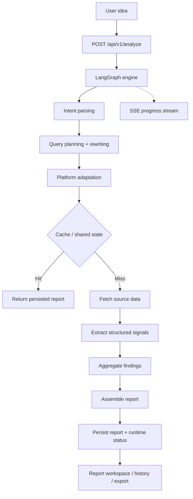

<div align="center">
  

  <h1>IdeaGo</h1>

  <p><strong>Turn a rough idea into a structured validation report in minutes.</strong></p>

  <p>
    IdeaGo cross-references 6 live sources — GitHub, Tavily, Hacker News, App Store, Product Hunt,
    and Reddit — to produce a decision-first report with recommendation, pain signals, commercial
    signals, whitespace opportunities, competitor landscape, evidence, and confidence scoring.
  </p>

  <p>
    <a href="README_CN.md">简体中文</a> ·
    <a href="#quick-start">Quick Start</a> ·
    <a href="#product-walkthrough">Product Walkthrough</a> ·
    <a href="#how-it-works">How It Works</a> ·
    <a href="DEPLOYMENT.md">Deployment</a> ·
    <a href="#acknowledgements">Acknowledgements</a>
  </p>

  <p>
    <a href="LICENSE"></a>
    
    
    
    
    
    <a href="ai_docs/AI_TOOLING_STANDARDS.md"></a>
  </p>
</div>

---

## Overview

Most idea validation stops at surface-level summaries. IdeaGo goes further: it tells you whether
an idea is worth pursuing right now, and backs the recommendation with structured evidence from
real community discussions, app reviews, open-source activity, and product launches.

The report is ordered by decision value — recommendation first, then pain signals, commercial
signals, whitespace opportunities, competitors, evidence trail, and confidence scoring.

This is the hosted edition (`saas` branch) with user authentication, profile, quota management,
and admin capabilities. For anonymous local usage without Supabase, see the `main` branch.

## Product Walkthrough

### Describe Your Idea

Enter a product idea in plain language. IdeaGo provides quick-start suggestions and shows your
recent reports for easy access.


### Real-time Analysis Pipeline

Watch the analysis unfold step by step: intent parsing, query planning, source retrieval across
6 platforms, signal extraction, and report assembly — all streamed live via SSE.


### Decision Summary

The report opens with what matters most: a clear recommendation, opportunity score, entry strategy,
and signal counts for pain themes, commercial indicators, and whitespace gaps.


### Market Context & Competitive Landscape

Understand the market timing and see how existing players map across feature completeness and
market presence through an interactive scatter chart.


### Pain Signals & Commercial Signals

Pain signals surface real user frustrations with strength and frequency scores. Commercial signals
highlight willingness-to-pay indicators and monetization clues from the market.


### Whitespace Opportunities

Identify underserved areas where existing products fall short, each scored by potential and
backed by supporting evidence references.


### Competitor Directory

Browse all discovered competitors with match scores, filterable by data source. Each card
shows key features, strengths, weaknesses, pricing, and a link to the original source.


### Evidence & Trust Metadata

Every conclusion traces back to source evidence. Trust metadata tags each piece by signal type
and platform, and trust warnings flag areas where confidence is limited.


## Quick Start

### Prerequisites

- Python 3.10+
- [uv](https://github.com/astral-sh/uv)
- Node.js 20+
- `pnpm`
- a Supabase project
- OpenAI API access

Recommended for a complete hosted setup:

- Tavily API key
- Stripe account and keys
- Sentry DSN

### Install

```bash
uv sync --all-extras
pnpm --prefix frontend install
```

### Configure

```bash
cp .env.example .env
cp frontend/.env.example frontend/.env
```

Minimum practical configuration:

- `OPENAI_API_KEY`
- `SUPABASE_URL`
- `SUPABASE_ANON_KEY`
- `SUPABASE_SERVICE_ROLE_KEY`
- `AUTH_SESSION_SECRET`
- `FRONTEND_APP_URL`

Frontend auth configuration:

- `VITE_SUPABASE_URL`
- `VITE_SUPABASE_ANON_KEY`
- `VITE_TURNSTILE_SITE_KEY`

For Docker deployments, these `VITE_*` values are build-time inputs for the frontend bundle.
Set them before `docker compose build` or `docker compose up --build`; runtime-only container env vars are not enough.

Billing is optional for local development, but production billing flows also need:

- `STRIPE_SECRET_KEY`
- `STRIPE_WEBHOOK_SECRET`
- `STRIPE_PRO_PRICE_ID`

### Run In Development

Terminal 1:

```bash
uv run uvicorn ideago.api.app:create_app --factory --reload --port 8000
```

Terminal 2:

```bash
pnpm --prefix frontend dev
```

Open:

- frontend: [http://localhost:5173](http://localhost:5173)
- backend health: [http://localhost:8000/api/v1/health](http://localhost:8000/api/v1/health)

### Single-Process Local Run

```bash
pnpm --prefix frontend build
uv run python -m ideago
```

Open: [http://localhost:8000](http://localhost:8000)

For deployment-shaped setup, use [DEPLOYMENT.md](DEPLOYMENT.md).

## How It Works

IdeaGo takes a single idea, normalizes it through intent parsing and query planning, gathers
evidence from 6 sources in parallel, extracts structured signals, and assembles a decision-first
report. The hosted edition wraps this pipeline with authentication, ownership, quota, and admin
operations.



Source roles are fixed:

- **Tavily** — broad recall and web coverage
- **Reddit** — pain language and migration discussions
- **GitHub** — open-source maturity and ecosystem signals
- **Hacker News** — builder sentiment and technical discourse
- **App Store** — review-cluster pain from real users
- **Product Hunt** — launch positioning and market entry patterns

## Hosted Features

The hosted edition adds operational capabilities on top of the core analysis engine:

- Authenticated user flows with Supabase-backed identity
- LinuxDo OAuth support and custom auth session handling
- User profile and quota management
- Admin routes for user management, quota adjustments, metrics, and health
- Supabase-backed persistence and PostgreSQL-powered shared runtime state
- Stripe integration points for checkout, portal, and webhook handling
- Landing page, legal pages, and hosted-product routing

## API Overview

Core report APIs:

- `POST /api/v1/analyze`
- `GET /api/v1/reports`
- `GET /api/v1/reports/{id}`
- `GET /api/v1/reports/{id}/status`
- `GET /api/v1/reports/{id}/stream`
- `GET /api/v1/reports/{id}/export`
- `DELETE /api/v1/reports/{id}`
- `DELETE /api/v1/reports/{id}/cancel`
- `GET /api/v1/health`

Auth APIs:

- `GET /api/v1/auth/linuxdo/start`
- `GET /api/v1/auth/linuxdo/callback`
- `GET /api/v1/auth/me`
- `POST /api/v1/auth/refresh`
- `GET /api/v1/auth/quota`
- `GET /api/v1/auth/profile`
- `PUT /api/v1/auth/profile`
- `DELETE /api/v1/auth/account`

Admin APIs:

- `GET /api/v1/admin/users`
- `PATCH /api/v1/admin/users/{user_id}/quota`
- `GET /api/v1/admin/stats`
- `GET /api/v1/admin/metrics`
- `GET /api/v1/admin/health`

Billing APIs:

- `POST /api/v1/billing/checkout`
- `POST /api/v1/billing/portal`
- `GET /api/v1/billing/status`
- `POST /api/v1/billing/webhook`

## Configuration Notes

Key settings:

- `SUPABASE_URL`
- `SUPABASE_ANON_KEY`
- `SUPABASE_SERVICE_ROLE_KEY`
- `SUPABASE_DB_URL`
- `AUTH_SESSION_SECRET`
- `AUTH_SESSION_EXPIRE_HOURS`
- `FRONTEND_APP_URL`
- `LINUXDO_CLIENT_ID`
- `LINUXDO_CLIENT_SECRET`
- `STRIPE_SECRET_KEY`
- `STRIPE_WEBHOOK_SECRET`
- `STRIPE_PRO_PRICE_ID`
- `SENTRY_DSN`

The authoritative env reference is [`.env.example`](.env.example), with frontend-specific variables
in [`frontend/.env.example`](frontend/.env.example).

## Project Structure

```text
.
├── src/ideago/          # API, auth, billing, pipeline, cache, models, sources
├── frontend/src/        # React app with landing, auth, profile, pricing, admin, reports
├── supabase/migrations/ # Database migrations
├── ai_docs/             # Project standards and guides
├── docs/assets/         # README screenshots
└── DEPLOYMENT.md        # Deployment guide
```

## Branch Model

- `main`: local or personal deployment, anonymous usage, no Supabase dependency
- `saas`: hosted product with auth, billing, profile, admin, and operational config

Shared product work lands on `main`; `saas` pulls from `main`.

## Documentation

- [Deployment Guide](DEPLOYMENT.md)
- [Contributing Guide](CONTRIBUTING.md)
- [AI Tooling Standards](ai_docs/AI_TOOLING_STANDARDS.md)
- [Backend Standards](ai_docs/BACKEND_STANDARDS.md)
- [Frontend Standards](ai_docs/FRONTEND_STANDARDS.md)

## Verification

```bash
uv run ruff check src tests scripts
uv run ruff format --check src tests scripts
uv run mypy src
uv run pytest

pnpm --prefix frontend lint
pnpm --prefix frontend typecheck
pnpm --prefix frontend test
pnpm --prefix frontend build
```

## Acknowledgements

Thanks to [Linux.do](https://linux.do/) for the references.

## License

MIT. See [LICENSE](LICENSE).
