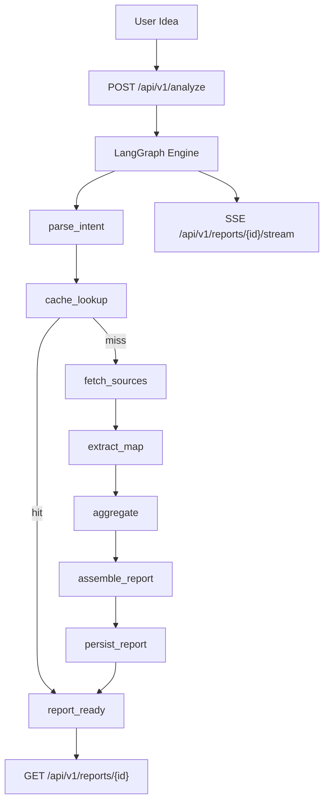

# IdeaGo


AI-powered competitor research engine for startup ideas.

[](https://www.python.org/)
[](https://fastapi.tiangolo.com/)
[](https://react.dev/)
[](https://www.langchain.com/langgraph)
[](LICENSE)

[简体中文](README.zh.md) · English

---

## Table of Contents

- [What IdeaGo Does](#what-ideago-does)
- [Key Features](#key-features)
- [Architecture](#architecture)
- [Tech Stack](#tech-stack)
- [Security Model](#security-model-after-app_api_key-removal)
- [Quick Start](#quick-start)
- [API Overview](#api-overview)
- [Report Model](#report-model)
- [Configuration](#configuration)
- [Project Structure](#project-structure)
- [Development & Quality](#development--quality)
- [Container & CI Notes](#container--ci-notes-after-app_api_key-removal)
- [Roadmap & Docs](#roadmap--docs)
- [Contributing](#contributing)
- [License](#license)

---

## What IdeaGo Does

IdeaGo turns one natural-language startup idea into a structured competitor report with:

- Market summary and recommendation (`go` / `caution` / `no_go`)
- Competitor list with traceable source links
- Differentiation opportunities
- Confidence, evidence, and runtime cost transparency

It is designed for fast founder validation: start with one sentence, get an auditable research report.

---

## Key Features

- **End-to-end pipeline**: intent parsing → source search → extraction → aggregation → report generation
- **Multi-source retrieval**: GitHub, Tavily Web Search, Hacker News, App Store, Product Hunt
- **Resilient LLM layer**: retry, JSON parse recovery, endpoint failover
- **Strict link grounding**: extracted links are filtered against fetched source URLs
- **Graceful degradation**: extraction/aggregation failures still return usable output
- **Real-time UX**: SSE streaming events with reconnect and cancellation
- **Transparent reports**: confidence/evidence/cost/failover metadata in every report
- **Performance-focused UI**: lazy routes, virtualized competitor lists, compare panel, export & print
- **Caching + runtime state**: file cache (TTL) + LangGraph SQLite checkpoints + status files

---

## Architecture



### Runtime notes

- `POST /analyze` starts background execution and returns `report_id` immediately.
- Frontend subscribes to SSE to render stage-by-stage progress.
- In-flight duplicate requests for the same normalized query are deduplicated.
- Built-in in-memory rate limiter for analyze endpoint: `10` requests / `60s` (per IP/session key).

---

## Security Model (After `APP_API_KEY` Removal)

`APP_API_KEY` / `X-API-Key` has been fully removed from backend, frontend, and runtime injection.

Current built-in controls:

- **Request throttling**: in-memory rate limit for `POST /api/v1/analyze` (`10` requests / `60s` per IP/session key).
- **CORS boundary**: `CORS_ALLOW_ORIGINS` controls allowed browser origins (avoid `*` on public deployments).
- **Input validation**: FastAPI + Pydantic schema validation for request payloads.
- **Safe error surface**: pipeline failures return sanitized client messages without exposing internal secrets.

Recommended deployment controls (especially if publicly reachable):

- Put IdeaGo behind a reverse proxy/API gateway (Nginx, Caddy, Cloudflare, Traefik).
- Add network-layer protection: IP allowlist, VPN, Zero Trust tunnel, or Basic Auth at gateway level.
- Terminate TLS at the gateway and keep backend service private within Docker network/VPC.
- Keep secrets only in runtime env (`OPENAI_API_KEY`, `TAVILY_API_KEY`, etc.); never bake into image layers.

---

## Tech Stack

### Backend

- Python 3.10+
- FastAPI + Uvicorn
- LangGraph state machine pipeline
- LangChain OpenAI client
- Pydantic v2 / pydantic-settings
- File cache + SQLite checkpoint store

### Frontend

- React 19 + TypeScript + Vite 7
- Tailwind CSS 4
- React Router 7
- i18next (zh/en)
- Framer Motion + Recharts

---

## Quick Start

### 1) Prerequisites

- Python `3.10+`
- [uv](https://github.com/astral-sh/uv)
- Node.js `20+`

### 2) Install dependencies

```bash
# Backend
uv sync --all-extras

# Frontend
npm --prefix frontend install
```

### 3) Configure environment

```bash
cp .env.example .env
```

Minimum recommended setup:

- Required: `OPENAI_API_KEY`
- Recommended: `TAVILY_API_KEY`

### 4) Development mode (hot reload)

Terminal 1:

```bash
uv run uvicorn ideago.api.app:create_app --factory --reload --port 8000
```

Terminal 2:

```bash
npm --prefix frontend run dev
```

Open:

- Frontend: [http://localhost:5173](http://localhost:5173)
- Backend API: [http://localhost:8000/api/v1/health](http://localhost:8000/api/v1/health)

### 5) Single-process local run (serve built frontend from backend)

```bash
npm --prefix frontend run build
uv run python -m ideago
```

Open: [http://localhost:8000](http://localhost:8000)

### 6) Docker

```bash
cp .env.example .env
docker compose up --build -d
```

Notes:

- Do **not** set `APP_API_KEY` (it is no longer supported).
- Keep only real provider secrets in `.env` (e.g. `OPENAI_API_KEY`, `TAVILY_API_KEY`).
- `docker-compose.yml` uses a prebuilt image by default. For local image build, use:

```bash
docker compose build --no-cache
docker compose up -d
```

Open: [http://localhost:8000](http://localhost:8000)

---

## API Overview

Base path: `/api/v1`

| Method | Path | Description |
|---|---|---|
| `POST` | `/analyze` | Start analysis, return `report_id` |
| `GET` | `/health` | Service health + source availability |
| `GET` | `/reports` | List reports (`limit`, `offset`) |
| `GET` | `/reports/{report_id}` | Get report (`202` while processing) |
| `GET` | `/reports/{report_id}/status` | Runtime status (`processing/failed/cancelled/complete/not_found`) |
| `GET` | `/reports/{report_id}/stream` | SSE progress stream |
| `GET` | `/reports/{report_id}/export` | Export markdown |
| `DELETE` | `/reports/{report_id}` | Delete report |
| `DELETE` | `/reports/{report_id}/cancel` | Cancel active analysis |

### SSE event types

`intent_started`, `intent_parsed`, `source_started`, `source_completed`, `source_failed`, `extraction_started`, `extraction_completed`, `aggregation_started`, `aggregation_completed`, `report_ready`, `cancelled`, `error`

### Example

```bash
# Start analysis
curl -X POST http://localhost:8000/api/v1/analyze \
  -H "Content-Type: application/json" \
  -d '{"query":"An AI assistant for indie game analytics"}'

# Stream events
curl -N http://localhost:8000/api/v1/reports/<report_id>/stream

# Fetch report
curl http://localhost:8000/api/v1/reports/<report_id>
```

---

## Report Model

Each report includes:

- **Core analysis**: competitors, market summary, recommendation, differentiation angles
- **Confidence**: sample size, source coverage, source success rate, confidence score, freshness hint
- **Evidence**: top evidence and structured evidence items
- **Cost telemetry**: LLM calls/retries/failovers, token usage, pipeline latency
- **Fault-tolerance metadata**: endpoint fallback usage and last error class

This makes conclusions inspectable instead of black-box.

---

## Configuration

See full defaults in `.env.example` and schema in `src/ideago/config/settings.py`.

| Variable | Required | Default | Purpose |
|---|---|---|---|
| `OPENAI_API_KEY` | Yes | `""` | LLM access key |
| `OPENAI_MODEL` | No | `gpt-4o-mini` | Primary model |
| `OPENAI_BASE_URL` | No | `""` | OpenAI-compatible endpoint |
| `OPENAI_FALLBACK_ENDPOINTS` | No | `""` | JSON array of fallback endpoints |
| `OPENAI_TIMEOUT_SECONDS` | No | `60` | LLM timeout |
| `LANGGRAPH_MAX_RETRIES` | No | `2` | Retry budget |
| `LANGGRAPH_JSON_PARSE_MAX_RETRIES` | No | `1` | JSON recovery retries |
| `TAVILY_API_KEY` | Recommended | `""` | Enable Tavily source |
| `GITHUB_TOKEN` | No | `""` | Higher GitHub rate limit |
| `PRODUCTHUNT_DEV_TOKEN` | No | `""` | Enable Product Hunt source |
| `APPSTORE_COUNTRY` | No | `us` | App Store country code |
| `PRODUCTHUNT_POSTED_AFTER_DAYS` | No | `730` | Product Hunt freshness window (days) |
| `MAX_RESULTS_PER_SOURCE` | No | `10` | Raw results per source |
| `SOURCE_TIMEOUT_SECONDS` | No | `30` | Source timeout |
| `SOURCE_QUERY_CONCURRENCY` | No | `2` | Per-source concurrency |
| `EXTRACTION_TIMEOUT_SECONDS` | No | `60` | LLM extraction timeout |
| `CACHE_DIR` | No | `.cache/ideago` | Cache directory |
| `CACHE_TTL_HOURS` | No | `24` | Cache TTL |
| `LANGGRAPH_CHECKPOINT_DB_PATH` | No | `.cache/ideago/langgraph-checkpoints.db` | LangGraph checkpoint DB |
| `CORS_ALLOW_ORIGINS` | No | `*` | CORS origins |
| `HOST` / `PORT` | No | `0.0.0.0` / `8000` | Server bind address |
| `VITE_API_BASE_URL` | No | `""` | Optional frontend API prefix |

---

## Project Structure

```text
.
├── src/ideago
│   ├── api/             # FastAPI app, routes, schemas, dependencies
│   ├── pipeline/        # LangGraph engine, nodes, events, state
│   ├── llm/             # Chat model client + prompt templates
│   ├── sources/         # Source plugins (GitHub/Tavily/HN/AppStore/Product Hunt)
│   ├── cache/           # File-based report/status cache
│   ├── models/          # Pydantic domain models
│   ├── config/          # Runtime settings
│   └── observability/   # Logging config
├── frontend/            # React + TypeScript UI
├── tests/               # Pytest suite
├── scripts/             # Release/dev automation scripts
├── doc/                 # Engineering docs
└── docs/                # Plans and design assets
```

---

## Development & Quality

Run relevant checks before submitting:

```bash
uv run ruff check src tests scripts
uv run ruff format --check src tests scripts
uv run mypy src
uv run pytest
npm --prefix frontend run lint
npm --prefix frontend run typecheck
npm --prefix frontend run test
npm --prefix frontend run build
```

---

## Container & CI Notes (After `APP_API_KEY` Removal)

### Dockerfile

- No `APP_API_KEY` build arg or env is required.
- Keep Dockerfile secret-free; pass secrets only at runtime.
- Current image entrypoint/runtime flow is already compatible with the removal.

### docker-compose

- No `APP_API_KEY` in `.env`, service `environment`, or `env_file`.
- If you deploy with prebuilt image, keep:
  - `image: <registry>/ideago:<tag>`
  - `env_file: .env`
- If you prefer local build, switch to:

```yaml
services:
  ideago:
    build:
      context: .
      dockerfile: Dockerfile
```

### CI image build/push

- Existing release workflow can stay unchanged for image build/push.
- Remove obsolete CI secrets/vars related to `APP_API_KEY` if present in repository settings.
- Keep only required runtime/provider secrets (for example `OPENAI_API_KEY` is needed by release-notes generation, not by Docker image build itself).

---

## Roadmap & Docs

- Changelog: [CHANGELOG.md](CHANGELOG.md)
- Contributing guide: [CONTRIBUTING.md](CONTRIBUTING.md)
- Backend standards: [doc/BACKEND_STANDARDS.md](doc/BACKEND_STANDARDS.md)
- Tooling standards: [doc/AI_TOOLING_STANDARDS.md](doc/AI_TOOLING_STANDARDS.md)
- Settings guide: [doc/SETTINGS_GUIDE.md](doc/SETTINGS_GUIDE.md)
- SDK usage: [doc/SDK_USAGE.md](doc/SDK_USAGE.md)

---

## Contributing

Issues and pull requests are welcome. Please read [CONTRIBUTING.md](CONTRIBUTING.md) before starting.

---

## License

MIT License. See [LICENSE](LICENSE).
