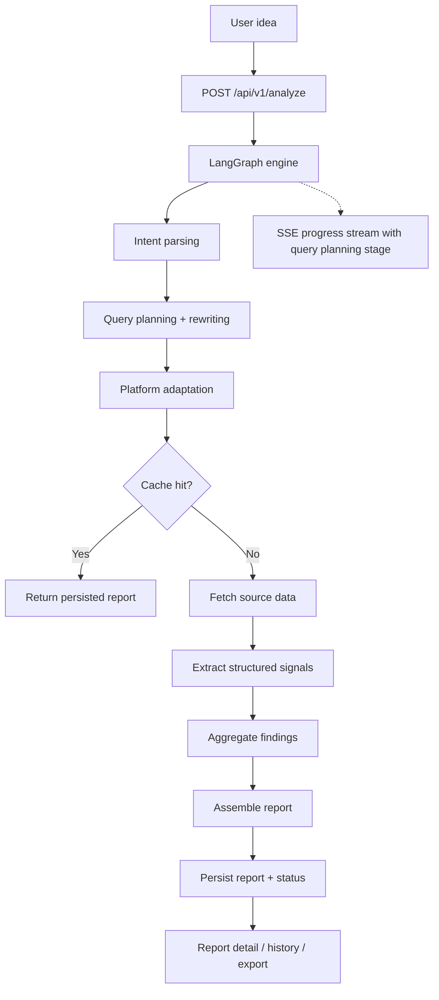

<div align="center">
  

  <h1>IdeaGo</h1>

  <p><strong>Decision-first source intelligence for startup ideas.</strong></p>

  <p>
    IdeaGo turns a rough product idea into a structured validation report with recommendation,
    pain signals, commercial signals, whitespace opportunities, competitors, evidence, and confidence.
  </p>

  <p>
    <a href="README_CN.md">简体中文</a> ·
    <a href="#quick-start">Quick Start</a> ·
    <a href="#how-it-works">How It Works</a> ·
    <a href="#project-structure">Project Structure</a> ·
    <a href="DEPLOYMENT.md">Deployment</a>
  </p>

  <p>
    <a href="LICENSE"></a>
    
    
    
    
    
    <a href="ai_docs/AI_TOOLING_STANDARDS.md"></a>
  </p>
</div>

---

## Overview

IdeaGo is the `main` branch of the project: a local or personal-deployment edition with no login,
no Supabase requirement, no billing, and no account system.

If you want the commercial version with auth, profile, billing, and admin flows, use the `saas`
branch instead.

## Screenshot

### Hero Screenshot


### Report Detail Screenshot


## Why IdeaGo

Most idea validation tools stop at surface-level summaries. IdeaGo is built for the question that
comes next: should this idea move forward now, and why?

It keeps the report decision-first:

- recommendation and why-now
- pain signals
- commercial signals
- whitespace opportunities
- competitors
- evidence
- confidence

That ordering is part of the product contract, not a presentation detail.

## What You Get On `main`

The `main` branch is the anonymous, personal-deployment line of the product:

- anonymous analysis flow
- persisted report history through local file cache
- report detail pages and markdown export
- SSE progress streaming during long-running analysis
- local SQLite checkpoints for LangGraph runtime state
- no Supabase, no Stripe, no LinuxDo variables required to boot

Core sources currently include:

- Tavily
- Reddit
- GitHub
- Hacker News
- App Store
- Product Hunt

## Quick Start

### Prerequisites

- Python 3.10+
- [uv](https://github.com/astral-sh/uv)
- Node.js 20+
- `pnpm`

### Install

```bash
uv sync --all-extras
pnpm --prefix frontend install
```

### Configure

```bash
cp .env.example .env
cp frontend/.env.example frontend/.env
```

Minimum useful configuration:

- required: `OPENAI_API_KEY`
- recommended: `TAVILY_API_KEY`

Useful defaults already live in [`.env.example`](.env.example).

### Run In Development

Terminal 1:

```bash
uv run uvicorn ideago.api.app:create_app --factory --reload --port 8000
```

Terminal 2:

```bash
pnpm --prefix frontend dev
```

Open:

- frontend: [http://localhost:5173](http://localhost:5173)
- backend health: [http://localhost:8000/api/v1/health](http://localhost:8000/api/v1/health)

### Run As A Single Local Process

```bash
pnpm --prefix frontend build
uv run python -m ideago
```

Open: [http://localhost:8000](http://localhost:8000)

### Run With Docker Compose (Remote Image)

The default `docker-compose.yml` uses the published Docker Hub image (`simonsun3/ideago`).

```bash
cp .env.example .env
docker compose pull
docker compose up -d
```

Optional: pin to a release tag instead of `latest`:

```bash
IDEAGO_IMAGE_TAG=0.3.8 docker compose up -d
```

Verify:

```bash
curl http://localhost:8000/api/v1/health
```

## How It Works

IdeaGo takes a single idea and pushes it through an explicit retrieval chain:
`intent_parser -> query_planning_rewriting -> platform_adaptation -> sources -> extractor -> aggregator`.
That chain produces a decision-first report that can be reopened from history later.



Runtime model on `main`:

- API routes: `/api/v1/analyze`, `/api/v1/reports`, `/api/v1/health`
- explicit query-planning stage before source fetch
- report persistence: local `FileCache`
- runtime checkpoints: local SQLite
- progress updates: SSE
- user flow: submit idea -> stream progress -> read report -> reopen from history -> export markdown

Fixed source-role split on `main`:

- Tavily for broad recall
- Reddit for pain and migration language
- GitHub for open-source maturity and ecosystem signals
- Hacker News for builder sentiment
- App Store for review-cluster pain
- Product Hunt for launch positioning

## API Overview

Public API on `main`:

- `POST /api/v1/analyze`
- `GET /api/v1/reports`
- `GET /api/v1/reports/{id}`
- `GET /api/v1/reports/{id}/status`
- `GET /api/v1/reports/{id}/stream`
- `GET /api/v1/reports/{id}/export`
- `DELETE /api/v1/reports/{id}`
- `DELETE /api/v1/reports/{id}/cancel`
- `GET /api/v1/health`

`main` does not expose auth, billing, profile, pricing, or admin APIs.

## Configuration Notes

Important settings on `main`:

- `OPENAI_API_KEY`
- `OPENAI_MODEL`
- `TAVILY_API_KEY`
- `CACHE_DIR`
- `ANONYMOUS_CACHE_TTL_HOURS`
- `FILE_CACHE_MAX_ENTRIES`
- `LANGGRAPH_CHECKPOINT_DB_PATH`
- `CORS_ALLOW_ORIGINS`

Optional Reddit credentials:

- `REDDIT_CLIENT_ID`
- `REDDIT_CLIENT_SECRET`

If Reddit OAuth credentials are missing, public read fallback can still work when
`REDDIT_ENABLE_PUBLIC_FALLBACK=true`.

## Branch Model

- `main`: personal/open-source deployment only
- `saas`: same core product, plus auth, billing, profile, admin, and SaaS-only environment variables

Sync rule:

- shared product work lands on `main`
- `saas` pulls from `main`
- do not move SaaS runtime dependencies back into `main`

## Project Structure

```text
.
├── src/ideago/          # FastAPI app, LangGraph pipeline, sources, models
├── frontend/src/        # React app
├── tests/               # Backend tests
├── ai_docs/             # Project standards and guides
├── assets/              # README assets used on main
└── DEPLOYMENT.md        # Main-branch deployment guide
```

Key backend areas:

- `api/`: routes, schemas, app setup, errors
- `pipeline/`: orchestration, events, merger, extractor, intent parsing
- `cache/`: file cache and persistence abstractions
- `sources/`: external source fetchers

Key frontend areas:

- `frontend/src/app`
- `frontend/src/features/home`
- `frontend/src/features/history`
- `frontend/src/features/reports`
- `frontend/src/lib/api`

## Documentation

- [Deployment Guide](DEPLOYMENT.md)
- [AI Tooling Standards](ai_docs/AI_TOOLING_STANDARDS.md)
- [Backend Standards](ai_docs/BACKEND_STANDARDS.md)
- [Frontend Standards](ai_docs/FRONTEND_STANDARDS.md)
- [Settings Guide](ai_docs/SETTINGS_GUIDE.md)

## Verification

```bash
uv run ruff check src tests scripts
uv run ruff format --check src tests scripts
uv run mypy src
uv run pytest

pnpm --prefix frontend lint
pnpm --prefix frontend typecheck
pnpm --prefix frontend test
pnpm --prefix frontend build
```

## FAQ

### Is this the SaaS version?

No. This README describes the `main` branch, which is meant for local or personal deployment.

### Does `main` require Supabase or Stripe?

No. `main` must boot and run without Supabase, Stripe, or LinuxDo variables.

### Where should SaaS docs live?

On the `saas` branch. Keep commercial deployment docs there instead of mixing them into `main`.

## License

MIT. See [LICENSE](LICENSE).
