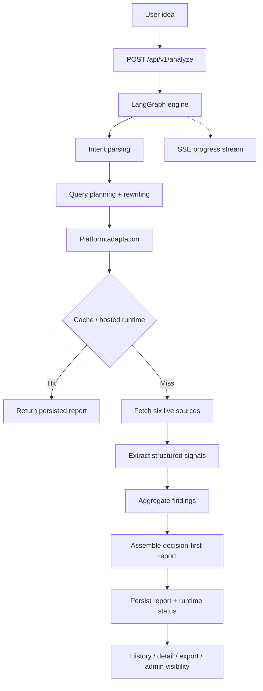

<div align="center">
  

  <h1>IdeaGo</h1>

  <p><strong>Hosted source-intelligence for idea validation.</strong></p>

  <p>
    IdeaGo turns a rough product idea into a decision-first validation report backed by
    live evidence from Tavily, Reddit, GitHub, Hacker News, App Store, and Product Hunt.
  </p>

  <p>
    <a href="README_CN.md">简体中文</a> ·
    <a href="#quick-start">Quick Start</a> ·
    <a href="#what-lives-on-the-saas-branch">Branch Scope</a> ·
    <a href="#how-it-works">How It Works</a> ·
    <a href="DEPLOYMENT.md">Deployment</a> ·
    <a href="frontend/README.md">Frontend Docs</a> ·
    <a href="ai_docs/AI_TOOLING_STANDARDS.md">ai_docs</a>
  </p>

  <p>
    <a href="LICENSE"></a>
    
    
    
    
    
  </p>
</div>

---

## Overview

This README describes the `saas` branch.

`saas` is the hosted/commercial edition of IdeaGo. It keeps the same Source Intelligence V2
analysis core as `main`, then adds:

- Supabase-backed auth and profile ownership
- email/password and Supabase OAuth sign-in
- LinuxDo OAuth with backend-managed session cookies
- user quota and account management
- admin dashboard and operational APIs
- Supabase-backed persistence, shared runtime state, and PostgREST-backed rate limiting
- landing and legal pages for a hosted product

If you need the anonymous, personal-deployment version with no account system, use the `main`
branch instead.

## What Lives On The `saas` Branch

### Current product contract

IdeaGo is no longer just a competitor lookup tool. The report contract is decision-first:

1. recommendation and why-now
2. pain signals
3. commercial signals
4. whitespace opportunities
5. competitors
6. evidence
7. confidence

Competitor discovery is still required, but it is only one section in the broader idea-validation
report.

### Current hosted product surface

- Public routes: landing page, login, auth callback, legal pages
- Signed-in routes: home workspace, report history, report detail, profile
- Admin route: `/admin`
- API families: `analyze`, `reports`, `auth`, `admin`, `billing`, `health`
- Report persistence: `ReportRepository` abstraction with file cache and Supabase-backed storage
- Runtime state: SQLite checkpoints plus shared hosted runtime state
- Progress updates: SSE

### Billing status

Stripe integration code exists, but pricing discovery is intentionally hidden right now:

- frontend `PRICING_ENABLED` is `false`
- `/pricing` is not exposed in the SPA
- `POST /api/v1/billing/checkout`
- `POST /api/v1/billing/portal`
- `GET /api/v1/billing/status`

These user-facing billing endpoints currently return a temporary not-found response until pricing
is re-enabled on purpose.

## Product Walkthrough

### Landing And Idea Intake

Signed-out visitors land on a marketing page. Signed-in users go directly to the product workspace
to submit an idea and start analysis.


### Real-Time Research Pipeline

Each analysis streams progress through intent parsing, query planning, platform adaptation,
multi-source retrieval, extraction, aggregation, and report assembly.


### Decision Summary

The report opens with the recommendation, why-now framing, opportunity score, and high-level
signal counts.


### Evidence-Backed Landscape

The hosted report workspace includes history, competitor details, trust metadata, charts, and
supporting evidence across all six sources.


## Quick Start

### Prerequisites

- Python 3.10+
- [uv](https://github.com/astral-sh/uv)
- Node.js 20+
- `pnpm`
- a Supabase project
- an OpenAI API key

Recommended for production-like usage:

- Tavily API key
- Cloudflare Turnstile site and secret keys
- GitHub token
- Product Hunt token
- Reddit OAuth credentials
- Sentry DSN

Optional today, but already wired in code:

- Stripe secret key, webhook secret, and price ID
- LinuxDo OAuth client credentials

### Install

```bash
uv sync --all-extras
pnpm --prefix frontend install
```

### Configure

```bash
cp .env.example .env
cp frontend/.env.example frontend/.env
```

Minimum practical backend configuration for the hosted branch:

- `OPENAI_API_KEY`
- `SUPABASE_URL`
- `SUPABASE_ANON_KEY`
- `SUPABASE_SERVICE_ROLE_KEY`
- `SUPABASE_DB_URL`
- `AUTH_SESSION_SECRET`
- `FRONTEND_APP_URL`
- `TURNSTILE_SECRET_KEY`

Minimum frontend build/runtime configuration:

- `VITE_SUPABASE_URL`
- `VITE_SUPABASE_ANON_KEY`
- `VITE_TURNSTILE_SITE_KEY`

Optional auth extensions:

- Supabase GitHub and Google providers in your Supabase dashboard
- `LINUXDO_CLIENT_ID`
- `LINUXDO_CLIENT_SECRET`

Optional observability and billing:

- `SENTRY_DSN`
- `VITE_SENTRY_DSN`
- `STRIPE_SECRET_KEY`
- `STRIPE_WEBHOOK_SECRET`
- `STRIPE_PRO_PRICE_ID`

For Docker builds, `VITE_*` values are build-time inputs. Set them before `docker compose build`
or `docker compose up --build`.

### Run In Development

Terminal 1:

```bash
uv run uvicorn ideago.api.app:create_app --factory --reload --port 8000
```

Terminal 2:

```bash
pnpm --prefix frontend dev
```

Open:

- frontend: [http://localhost:5173](http://localhost:5173)
- backend health: [http://localhost:8000/api/v1/health](http://localhost:8000/api/v1/health)

### Single-Process Local Run

```bash
pnpm --prefix frontend build
uv run python -m ideago
```

Open: [http://localhost:8000](http://localhost:8000)

### Docker Compose

The `saas` branch `docker-compose.yml` builds a local image from this repository and forwards the
required frontend build args into the container build.

```bash
docker compose build
docker compose up -d
```

See [DEPLOYMENT.md](DEPLOYMENT.md) for the full hosted deployment checklist.

## How It Works

IdeaGo runs an explicit Source Intelligence V2 pipeline:

`intent_parser -> query_planning_rewriting -> platform_adaptation -> sources -> extractor -> aggregator`

The hosted edition wraps that pipeline with auth, persistence ownership, quota, admin, and session
handling.



Fixed source roles:

- Tavily for broad recall
- Reddit for pain and migration language
- GitHub for open-source maturity and ecosystem signals
- Hacker News for builder sentiment
- App Store for review-cluster pain
- Product Hunt for launch positioning

## Auth And User Model

The hosted branch currently supports:

- Supabase email/password auth
- Supabase OAuth providers such as GitHub and Google
- LinuxDo OAuth via backend callback and HTTP-only session cookie

User-facing account features include:

- current-user bootstrap through `/api/v1/auth/me`
- quota visibility through `/api/v1/auth/quota`
- editable profile through `/api/v1/auth/profile`
- account deletion through `/api/v1/auth/account`

Quota contract notes:

- admin overrides are stored in `profiles.plan_limit_override`
- API responses continue exposing `plan_limit` as the effective display limit
- `503 DEPENDENCY_UNAVAILABLE` means Supabase or hosted persistence is degraded, not that the user has no data
- failed account deletion attempts now use phase-aware compensation:
- early failures try to clear `deletion_pending`
- later failures may only restore access or leave the account in a stuck-pending state that requires operator intervention

## API Overview

### Analysis and reports

- `POST /api/v1/analyze`
- `GET /api/v1/reports`
- `GET /api/v1/reports/{id}`
- `GET /api/v1/reports/{id}/status`
- `GET /api/v1/reports/{id}/stream`
- `GET /api/v1/reports/{id}/export`
- `DELETE /api/v1/reports/{id}`
- `DELETE /api/v1/reports/{id}/cancel`
- `GET /api/v1/health`

### Auth

- `POST /api/v1/auth/linuxdo/start`
- `GET /api/v1/auth/linuxdo/callback`
- `GET /api/v1/auth/me`
- `POST /api/v1/auth/refresh`
- `POST /api/v1/auth/logout`
- `GET /api/v1/auth/quota`
- `GET /api/v1/auth/profile`
- `PUT /api/v1/auth/profile`
- `DELETE /api/v1/auth/account`

Mutating auth/admin/report requests that rely on the cookie-backed session must send
`X-Requested-With`, and when browsers provide `Origin` or `Referer` those headers must match the
configured allowlist.

### Admin

- `GET /api/v1/admin/users`
- `PATCH /api/v1/admin/users/{user_id}/quota`
- `GET /api/v1/admin/stats`
- `GET /api/v1/admin/metrics`
- `GET /api/v1/admin/health`

### Billing integration

- `POST /api/v1/billing/checkout`
- `POST /api/v1/billing/portal`
- `GET /api/v1/billing/status`
- `POST /api/v1/billing/webhook`

Remember: checkout, portal, and status are intentionally hidden from users until pricing is
re-enabled. The webhook route stays mounted so Stripe events can still update hosted billing state.

Analysis persistence notes:

- the initial `processing` status write is treated as a critical dependency
- if hosted status persistence fails, `POST /api/v1/analyze` now returns `503` and rolls back quota plus processing reservation

## Project Structure

### Backend

- `src/ideago/api`: FastAPI app, routes, middleware, schemas, dependencies
- `src/ideago/auth`: auth dependencies, session helpers, Supabase admin helpers
- `src/ideago/billing`: Stripe integration layer
- `src/ideago/cache`: file and Supabase-backed report repositories
- `src/ideago/config`: runtime settings
- `src/ideago/models`: domain models and report contracts
- `src/ideago/pipeline`: orchestration, extraction, aggregation, typed report assembly
- `src/ideago/sources`: Tavily, Reddit, GitHub, Hacker News, App Store, Product Hunt

### Frontend

- `frontend/src/app`: router, shell, navbar, error boundary
- `frontend/src/features/auth`: login and callback flows
- `frontend/src/features/history`: persisted report history
- `frontend/src/features/home`: signed-in workspace
- `frontend/src/features/landing`: marketing entry for signed-out users
- `frontend/src/features/profile`: user settings and subscription state
- `frontend/src/features/reports`: report detail and progress UI
- `frontend/src/features/admin`: hosted admin dashboard
- `frontend/src/lib/api`: typed API client and SSE logic
- `frontend/src/lib/auth`: auth context, redirect helpers, token/session handling

## Documentation Map

- Core engineering contract: [ai_docs/AI_TOOLING_STANDARDS.md](ai_docs/AI_TOOLING_STANDARDS.md)
- Backend conventions: [ai_docs/BACKEND_STANDARDS.md](ai_docs/BACKEND_STANDARDS.md)
- Frontend conventions: [ai_docs/FRONTEND_STANDARDS.md](ai_docs/FRONTEND_STANDARDS.md)
- Settings and env vars: [ai_docs/SETTINGS_GUIDE.md](ai_docs/SETTINGS_GUIDE.md)
- Frontend-specific notes: [frontend/README.md](frontend/README.md)
- Deployment runbook: [DEPLOYMENT.md](DEPLOYMENT.md)
- Contribution guide: [CONTRIBUTING.md](CONTRIBUTING.md)

## Verification

Run what applies before you call a change complete:

```bash
# Backend
uv run ruff check src tests scripts
uv run ruff format --check src tests scripts
uv run mypy src
uv run pytest

# Frontend
pnpm --prefix frontend lint
pnpm --prefix frontend typecheck
pnpm --prefix frontend test
pnpm --prefix frontend build
```
