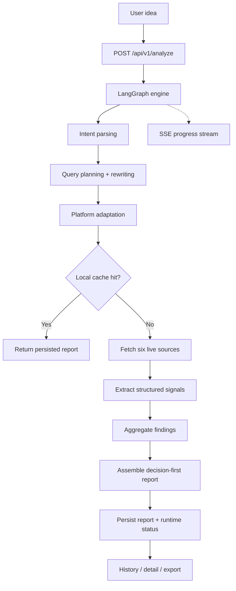

<div align="center">
  

  <h1>IdeaGo</h1>

  <p><strong>Decision-first source intelligence for startup ideas.</strong></p>

  <p>
    IdeaGo turns a rough product idea into a structured validation report with recommendation,
    why-now framing, pain signals, commercial signals, whitespace opportunities, competitors,
    evidence, and confidence.
  </p>

  <p>
    <a href="README_CN.md">简体中文</a> ·
    <a href="#quick-start">Quick Start</a> ·
    <a href="#what-lives-on-main">Branch Scope</a> ·
    <a href="#how-it-works">How It Works</a> ·
    <a href="DEPLOYMENT.md">Deployment</a> ·
    <a href="ai_docs/AI_TOOLING_STANDARDS.md">ai_docs</a>
  </p>

  <p>
    <a href="LICENSE"></a>
    
    
    
    
  </p>
</div>

---

## Overview

This README describes the `main` branch.

`main` is the anonymous and personal-deployment line of IdeaGo. It keeps the same Source
Intelligence V2 analysis engine as `saas`, but intentionally excludes hosted runtime concerns:

- no login
- no profile system
- no Supabase requirement to boot
- no admin dashboard
- no billing or pricing UI

If you need the hosted product with auth, profile ownership, admin APIs, and SaaS deployment
behavior, switch to the `saas` branch.

## What Lives On `main`

### Current product contract

IdeaGo is not just a competitor lookup flow anymore. The report contract is decision-first:

1. recommendation and why-now
2. pain signals
3. commercial signals
4. whitespace opportunities
5. competitors
6. evidence
7. confidence

### Current runtime surface

- anonymous idea submission
- SSE progress streaming
- local file-cache persistence for report history
- report detail and markdown export
- local SQLite checkpoints for LangGraph state
- no account ownership model

### Current route surface

- `/`
- `/reports`
- `/reports/:id`

The codebase contains some additional shared/legal UI files, but the active router on `main`
stays intentionally small and anonymous.

## Screenshots

### Home


### Report Detail


## Quick Start

### Prerequisites

- Python 3.10+
- [uv](https://github.com/astral-sh/uv)
- Node.js 20+
- `pnpm`

Minimum useful secret:

- `OPENAI_API_KEY`

Recommended for better data coverage:

- `TAVILY_API_KEY`
- `GITHUB_TOKEN`
- `PRODUCTHUNT_DEV_TOKEN`
- `REDDIT_CLIENT_ID`
- `REDDIT_CLIENT_SECRET`

### Install

```bash
uv sync --all-extras
pnpm --prefix frontend install
```

### Configure

```bash
cp .env.example .env
cp frontend/.env.example frontend/.env
```

Minimum practical configuration:

- `OPENAI_API_KEY`

Common local runtime settings:

- `CACHE_DIR`
- `ANONYMOUS_CACHE_TTL_HOURS`
- `FILE_CACHE_MAX_ENTRIES`
- `LANGGRAPH_CHECKPOINT_DB_PATH`
- `CORS_ALLOW_ORIGINS`

Frontend config on `main` is intentionally small:

- `VITE_API_BASE_URL`
- `VITE_SENTRY_DSN` if desired

### Run In Development

Terminal 1:

```bash
uv run uvicorn ideago.api.app:create_app --factory --reload --port 8000
```

Terminal 2:

```bash
pnpm --prefix frontend dev
```

Open:

- frontend: [http://localhost:5173](http://localhost:5173)
- backend health: [http://localhost:8000/api/v1/health](http://localhost:8000/api/v1/health)

### Single-Process Local Run

```bash
pnpm --prefix frontend build
uv run python -m ideago
```

Open: [http://localhost:8000](http://localhost:8000)

### Docker Compose

`main` ships with a simple `docker-compose.yml` that pulls the published image from Docker Hub:

```bash
docker compose pull
docker compose up -d
```

Optional: pin to a release tag instead of `latest`:

```bash
IDEAGO_IMAGE_TAG=0.3.8 docker compose up -d
```

If you prefer to build from source, the branch also includes a Dockerfile.

## How It Works

IdeaGo runs an explicit Source Intelligence V2 pipeline:

`intent_parser -> query_planning_rewriting -> platform_adaptation -> sources -> extractor -> aggregator`

That pipeline produces a decision-first report which is then persisted locally for later reopening.



Fixed source roles:

- Tavily for broad recall
- Reddit for pain and migration language
- GitHub for open-source maturity and ecosystem signals
- Hacker News for builder sentiment
- App Store for review-cluster pain
- Product Hunt for launch positioning

## API Overview

Public API on `main`:

- `POST /api/v1/analyze`
- `GET /api/v1/reports`
- `GET /api/v1/reports/{id}`
- `GET /api/v1/reports/{id}/status`
- `GET /api/v1/reports/{id}/stream`
- `GET /api/v1/reports/{id}/export`
- `DELETE /api/v1/reports/{id}`
- `DELETE /api/v1/reports/{id}/cancel`
- `GET /api/v1/health`

`main` does not expose auth, billing, profile, pricing, or admin APIs.

## Configuration Notes

Important settings on `main`:

- `OPENAI_API_KEY`
- `OPENAI_MODEL`
- `TAVILY_API_KEY`
- `CACHE_DIR`
- `ANONYMOUS_CACHE_TTL_HOURS`
- `FILE_CACHE_MAX_ENTRIES`
- `LANGGRAPH_CHECKPOINT_DB_PATH`
- `CORS_ALLOW_ORIGINS`

Optional Reddit settings:

- `REDDIT_CLIENT_ID`
- `REDDIT_CLIENT_SECRET`
- `REDDIT_ENABLE_PUBLIC_FALLBACK`
- `REDDIT_PUBLIC_FALLBACK_LIMIT`
- `REDDIT_PUBLIC_FALLBACK_DELAY_SECONDS`

On `main`, public Reddit fallback is allowed by default unless you configure OAuth credentials.

## Project Structure

### Backend

- `src/ideago/api`: FastAPI app, routes, middleware, schemas
- `src/ideago/cache`: local report persistence
- `src/ideago/config`: runtime settings
- `src/ideago/models`: domain models and report contracts
- `src/ideago/pipeline`: orchestration, extraction, aggregation, report assembly
- `src/ideago/sources`: six data-source adapters

### Frontend

- `frontend/src/app`: router, shell, navbar, error boundary
- `frontend/src/features/home`: main search experience
- `frontend/src/features/history`: local report history
- `frontend/src/features/reports`: report detail and progress views
- `frontend/src/lib/api`: typed API client and SSE hook
- `frontend/src/lib/i18n`: locale setup and translations
- `frontend/src/components/ui`: shared UI primitives

## Branch Model

- `main`: anonymous/personal deployment line
- `saas`: hosted/commercial line

Sync rule:

- shared product work lands on `main`
- `saas` pulls from `main`
- do not move hosted-only runtime dependencies back into `main`

## Documentation Map

- Core engineering contract: [ai_docs/AI_TOOLING_STANDARDS.md](ai_docs/AI_TOOLING_STANDARDS.md)
- Backend conventions: [ai_docs/BACKEND_STANDARDS.md](ai_docs/BACKEND_STANDARDS.md)
- Frontend conventions: [ai_docs/FRONTEND_STANDARDS.md](ai_docs/FRONTEND_STANDARDS.md)
- Settings and env vars: [ai_docs/SETTINGS_GUIDE.md](ai_docs/SETTINGS_GUIDE.md)
- Deployment runbook: [DEPLOYMENT.md](DEPLOYMENT.md)

## Verification

Run what applies before you call a change complete:

```bash
# Backend
uv run ruff check src tests scripts
uv run ruff format --check src tests scripts
uv run mypy src
uv run pytest

# Frontend
pnpm --prefix frontend lint
pnpm --prefix frontend typecheck
pnpm --prefix frontend test
pnpm --prefix frontend build
```
