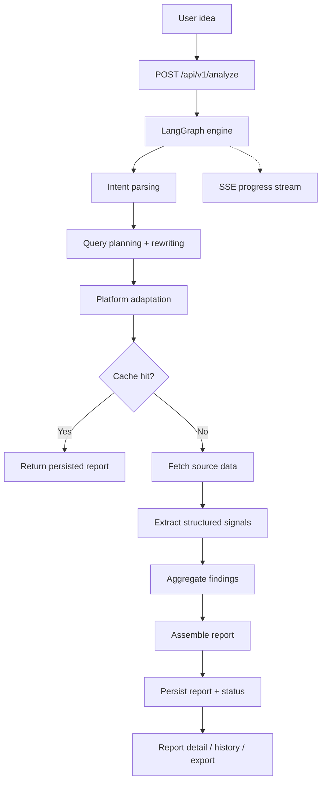

<div align="center">
  

  <h1>IdeaGo</h1>

  <p><strong>Turn a rough idea into a structured validation report in minutes.</strong></p>

  <p>
    IdeaGo cross-references 6 live sources — GitHub, Tavily, Hacker News, App Store, Product Hunt,
    and Reddit — to produce a decision-first report with recommendation, pain signals, commercial
    signals, whitespace opportunities, competitor landscape, evidence, and confidence scoring.
  </p>

  <p>
    <a href="README_CN.md">简体中文</a> ·
    <a href="#quick-start">Quick Start</a> ·
    <a href="#product-walkthrough">Product Walkthrough</a> ·
    <a href="#how-it-works">How It Works</a> ·
    <a href="DEPLOYMENT.md">Deployment</a>
  </p>

  <p>
    <a href="LICENSE"></a>
    
    
    
    
    <a href="ai_docs/AI_TOOLING_STANDARDS.md"></a>
  </p>
</div>

---

## Overview

Most idea validation stops at surface-level summaries. IdeaGo goes further: it tells you whether
an idea is worth pursuing right now, and backs the recommendation with structured evidence from
real community discussions, app reviews, open-source activity, and product launches.

The report is ordered by decision value — recommendation first, then pain signals, commercial
signals, whitespace opportunities, competitors, evidence trail, and confidence scoring.

This edition runs locally with no login required. A hosted version with authentication and billing
is available on the `saas` branch.

## Product Walkthrough

### Describe Your Idea

Enter a product idea in plain language. IdeaGo provides quick-start suggestions and shows your
recent reports for easy access.


### Real-time Analysis Pipeline

Watch the analysis unfold step by step: intent parsing, query planning, source retrieval across
6 platforms, signal extraction, and report assembly — all streamed live via SSE.


### Decision Summary

The report opens with what matters most: a clear recommendation, opportunity score, entry strategy,
and signal counts for pain themes, commercial indicators, and whitespace gaps.


### Market Context & Competitive Landscape

Understand the market timing and see how existing players map across feature completeness and
market presence through an interactive scatter chart.


### Pain Signals & Commercial Signals

Pain signals surface real user frustrations with strength and frequency scores. Commercial signals
highlight willingness-to-pay indicators and monetization clues from the market.


### Whitespace Opportunities

Identify underserved areas where existing products fall short, each scored by potential and
backed by supporting evidence references.


### Competitor Directory

Browse all discovered competitors with match scores, filterable by data source. Each card
shows key features, strengths, weaknesses, pricing, and a link to the original source.


### Evidence & Trust Metadata

Every conclusion traces back to source evidence. Trust metadata tags each piece by signal type
and platform, and trust warnings flag areas where confidence is limited.


## Features

- Anonymous analysis flow with no login required
- Persisted report history through local file cache
- Report detail pages and markdown export
- SSE progress streaming with live pipeline steps
- Local SQLite checkpoints for LangGraph runtime state
- Docker Compose deployment with published image

## Quick Start

### Prerequisites

- Python 3.10+
- [uv](https://github.com/astral-sh/uv)
- Node.js 20+
- `pnpm`

### Install

```bash
uv sync --all-extras
pnpm --prefix frontend install
```

### Configure

```bash
cp .env.example .env
cp frontend/.env.example frontend/.env
```

Minimum useful configuration:

- required: `OPENAI_API_KEY`
- recommended: `TAVILY_API_KEY`

Useful defaults already live in [`.env.example`](.env.example).

### Run In Development

Terminal 1:

```bash
uv run uvicorn ideago.api.app:create_app --factory --reload --port 8000
```

Terminal 2:

```bash
pnpm --prefix frontend dev
```

Open:

- frontend: [http://localhost:5173](http://localhost:5173)
- backend health: [http://localhost:8000/api/v1/health](http://localhost:8000/api/v1/health)

### Run As A Single Local Process

```bash
pnpm --prefix frontend build
uv run python -m ideago
```

Open: [http://localhost:8000](http://localhost:8000)

### Run With Docker Compose (Remote Image)

The default `docker-compose.yml` uses the published Docker Hub image (`simonsun3/ideago`).

```bash
cp .env.example .env
docker compose pull
docker compose up -d
```

Optional: pin to a release tag instead of `latest`:

```bash
IDEAGO_IMAGE_TAG=0.3.8 docker compose up -d
```

Verify:

```bash
curl http://localhost:8000/api/v1/health
```

## How It Works

IdeaGo takes a single idea, normalizes it through intent parsing and query planning, gathers
evidence from 6 sources in parallel, extracts structured signals, and assembles a decision-first
report that can be reopened from history later.



Source roles are fixed:

- **Tavily** — broad recall and web coverage
- **Reddit** — pain language and migration discussions
- **GitHub** — open-source maturity and ecosystem signals
- **Hacker News** — builder sentiment and technical discourse
- **App Store** — review-cluster pain from real users
- **Product Hunt** — launch positioning and market entry patterns

## API Overview

- `POST /api/v1/analyze`
- `GET /api/v1/reports`
- `GET /api/v1/reports/{id}`
- `GET /api/v1/reports/{id}/status`
- `GET /api/v1/reports/{id}/stream`
- `GET /api/v1/reports/{id}/export`
- `DELETE /api/v1/reports/{id}`
- `DELETE /api/v1/reports/{id}/cancel`
- `GET /api/v1/health`

## Configuration Notes

Key settings:

- `OPENAI_API_KEY`
- `OPENAI_MODEL`
- `TAVILY_API_KEY`
- `CACHE_DIR`
- `ANONYMOUS_CACHE_TTL_HOURS`
- `FILE_CACHE_MAX_ENTRIES`
- `LANGGRAPH_CHECKPOINT_DB_PATH`
- `CORS_ALLOW_ORIGINS`

Optional Reddit credentials:

- `REDDIT_CLIENT_ID`
- `REDDIT_CLIENT_SECRET`

If Reddit OAuth credentials are missing, public read fallback can still work when
`REDDIT_ENABLE_PUBLIC_FALLBACK=true`.

## Project Structure

```text
.
├── src/ideago/          # FastAPI app, LangGraph pipeline, sources, models
├── frontend/src/        # React app
├── tests/               # Backend tests
├── ai_docs/             # Project standards and guides
├── docs/assets/         # README screenshots
└── DEPLOYMENT.md        # Deployment guide
```

## Documentation

- [Deployment Guide](DEPLOYMENT.md)
- [AI Tooling Standards](ai_docs/AI_TOOLING_STANDARDS.md)
- [Backend Standards](ai_docs/BACKEND_STANDARDS.md)
- [Frontend Standards](ai_docs/FRONTEND_STANDARDS.md)
- [Settings Guide](ai_docs/SETTINGS_GUIDE.md)

## Verification

```bash
uv run ruff check src tests scripts
uv run ruff format --check src tests scripts
uv run mypy src
uv run pytest

pnpm --prefix frontend lint
pnpm --prefix frontend typecheck
pnpm --prefix frontend test
pnpm --prefix frontend build
```

## License

MIT. See [LICENSE](LICENSE).
