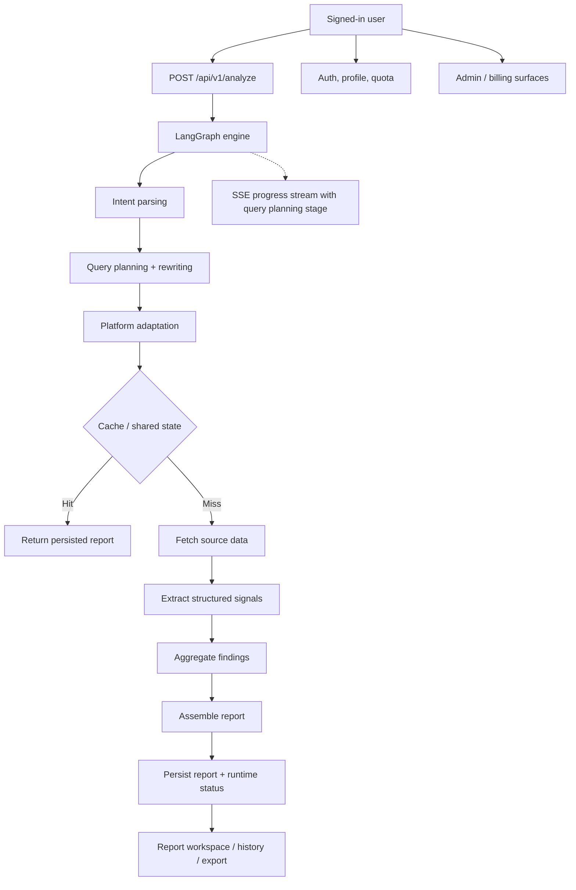

<div align="center">
  

  <h1>IdeaGo</h1>

  <p><strong>SaaS-grade source intelligence for idea validation and operator workflows.</strong></p>

  <p>
    The <code>saas</code> branch extends IdeaGo with authentication, profile, quota, admin, and
    commercial deployment concerns while keeping the same decision-first report contract.
  </p>

  <p>
    <a href="README_CN.md">简体中文</a> ·
    <a href="#quick-start">Quick Start</a> ·
    <a href="#saas-capabilities">SaaS Capabilities</a> ·
    <a href="#how-it-works">How It Works</a> ·
    <a href="DEPLOYMENT.md">Deployment</a>
  </p>

  <p>
    <a href="LICENSE"></a>
    
    
    
    
    
    <a href="ai_docs/AI_TOOLING_STANDARDS.md"></a>
  </p>
</div>

---

## Overview

This README describes the `saas` branch.

It shares the same core Source Intelligence V2 report pipeline as `main`, but adds the operational
pieces you need for a hosted product: user authentication, profile and quota management, admin
surfaces, Supabase-backed persistence, and production-oriented deployment requirements.

If you want the simpler local or personal-deployment edition with anonymous usage and no Supabase,
go to the `main` branch instead.

## Screenshot Placeholders

> Replace these placeholders with your own product shots when you are ready.

### Hero Screenshot


`[Placeholder] Replace this image with the SaaS landing page or signed-in workflow.`

### Report Workspace Screenshot


`[Placeholder] Replace this image with the authenticated report experience or dashboard.`

### Admin / Account Screenshot

`[Placeholder] Add a screenshot for profile, quota, billing, or admin tooling.`

## Why The `saas` Branch Exists

The `main` branch is intentionally lightweight. The `saas` branch is where IdeaGo becomes a hosted
product with identity, ownership, and operations layered on top of the same core analysis engine.

It keeps the same report contract:

- recommendation and why-now
- pain signals
- commercial signals
- whitespace opportunities
- competitors
- evidence
- confidence

The extra surface area is about product operations, not changing the order of decisions inside the
report.

## SaaS Capabilities

Compared with `main`, the `saas` branch adds:

- authenticated user flows with Supabase-backed identity
- LinuxDo OAuth support and custom auth session handling
- user profile and quota endpoints
- admin routes for user management, quota changes, metrics, and health
- Supabase-backed persistence and PostgreSQL-powered shared runtime state
- Stripe integration points for checkout, portal, and webhook handling
- legal pages, landing page, and hosted-product routing

Current implementation note:

- pricing and billing infrastructure exist on this branch
- the pricing UI is still feature-flagged off in `frontend/src/lib/featureFlags.ts`

Core sources remain:

- Tavily
- Reddit
- GitHub
- Hacker News
- App Store
- Product Hunt

## Quick Start

### Prerequisites

- Python 3.10+
- [uv](https://github.com/astral-sh/uv)
- Node.js 20+
- `pnpm`
- a Supabase project
- OpenAI API access

Recommended for a complete hosted setup:

- Tavily API key
- Stripe account and keys
- Sentry DSN

### Install

```bash
uv sync --all-extras
pnpm --prefix frontend install
```

### Configure

```bash
cp .env.example .env
cp frontend/.env.example frontend/.env
```

Minimum practical configuration for `saas`:

- `OPENAI_API_KEY`
- `SUPABASE_URL`
- `SUPABASE_ANON_KEY`
- `SUPABASE_SERVICE_ROLE_KEY`
- `AUTH_SESSION_SECRET`
- `FRONTEND_APP_URL`

Frontend auth configuration:

- `VITE_SUPABASE_URL`
- `VITE_SUPABASE_ANON_KEY`
- `VITE_TURNSTILE_SITE_KEY`

For Docker deployments, these `VITE_*` values are build-time inputs for the frontend bundle.
Set them before `docker compose build` or `docker compose up --build`; runtime-only container env vars are not enough.

Billing is optional for local development, but production billing flows also need:

- `STRIPE_SECRET_KEY`
- `STRIPE_WEBHOOK_SECRET`
- `STRIPE_PRO_PRICE_ID`

### Run In Development

Terminal 1:

```bash
uv run uvicorn ideago.api.app:create_app --factory --reload --port 8000
```

Terminal 2:

```bash
pnpm --prefix frontend dev
```

Open:

- frontend: [http://localhost:5173](http://localhost:5173)
- backend health: [http://localhost:8000/api/v1/health](http://localhost:8000/api/v1/health)

### Single-Process Local Run

```bash
pnpm --prefix frontend build
uv run python -m ideago
```

Open: [http://localhost:8000](http://localhost:8000)

For deployment-shaped setup, use [DEPLOYMENT.md](DEPLOYMENT.md).

## How It Works

The analysis pipeline is still decision-first, but it now uses an explicit retrieval chain:
`intent_parser -> query_planning_rewriting -> platform_adaptation -> sources -> extractor -> aggregator`.
On `saas`, that chain is wrapped by identity, ownership, quota, and admin operations.



Runtime model on `saas`:

- authenticated analyze flow
- explicit query-planning progress step before source fetch
- protected report history and report detail pages
- profile and quota management
- admin dashboards and operational APIs
- Supabase-backed user data and shared persistence
- PostgreSQL checkpoint support for distributed runtime state

Source-role split stays fixed across the hosted product:

- Tavily for broad recall
- Reddit for pain and switching language
- GitHub for open-source maturity and ecosystem signals
- Hacker News for builder sentiment
- App Store for review-cluster pain
- Product Hunt for launch positioning

## API Overview

Core report APIs:

- `POST /api/v1/analyze`
- `GET /api/v1/reports`
- `GET /api/v1/reports/{id}`
- `GET /api/v1/reports/{id}/status`
- `GET /api/v1/reports/{id}/stream`
- `GET /api/v1/reports/{id}/export`
- `DELETE /api/v1/reports/{id}`
- `DELETE /api/v1/reports/{id}/cancel`
- `GET /api/v1/health`

Auth APIs:

- `GET /api/v1/auth/linuxdo/start`
- `GET /api/v1/auth/linuxdo/callback`
- `GET /api/v1/auth/me`
- `POST /api/v1/auth/refresh`
- `GET /api/v1/auth/quota`
- `GET /api/v1/auth/profile`
- `PUT /api/v1/auth/profile`
- `DELETE /api/v1/auth/account`

Admin APIs:

- `GET /api/v1/admin/users`
- `PATCH /api/v1/admin/users/{user_id}/quota`
- `GET /api/v1/admin/stats`
- `GET /api/v1/admin/metrics`
- `GET /api/v1/admin/health`

Billing APIs on this branch:

- `POST /api/v1/billing/checkout`
- `POST /api/v1/billing/portal`
- `GET /api/v1/billing/status`
- `POST /api/v1/billing/webhook`

Current behavior note:

- billing routes exist, but user-facing checkout and portal flows are intentionally hidden until
  pricing is re-enabled

## Configuration Notes

Important SaaS settings:

- `SUPABASE_URL`
- `SUPABASE_ANON_KEY`
- `SUPABASE_SERVICE_ROLE_KEY`
- `SUPABASE_DB_URL`
- `AUTH_SESSION_SECRET`
- `AUTH_SESSION_EXPIRE_HOURS`
- `FRONTEND_APP_URL`
- `LINUXDO_CLIENT_ID`
- `LINUXDO_CLIENT_SECRET`
- `STRIPE_SECRET_KEY`
- `STRIPE_WEBHOOK_SECRET`
- `STRIPE_PRO_PRICE_ID`
- `SENTRY_DSN`

The authoritative env reference is [`.env.example`](.env.example), with frontend-specific variables
in [`frontend/.env.example`](frontend/.env.example).

## Branch Model

- `main`: local or personal deployment, anonymous usage, no Supabase dependency
- `saas`: hosted product line with auth, billing hooks, profile, admin, and SaaS-only runtime config

Sync rule:

- shared product work lands on `main`
- `saas` pulls from `main`
- SaaS-specific runtime dependencies stay on `saas`

## Project Structure

```text
.
├── src/ideago/          # API, auth, billing, pipeline, cache, models, sources
├── frontend/src/        # React app with landing, auth, profile, pricing, admin, reports
├── supabase/migrations/ # SaaS database migrations
├── ai_docs/             # Project standards and guides
├── docs/assets/         # README assets used on saas
└── DEPLOYMENT.md        # SaaS deployment guide
```

Notable SaaS-specific areas:

- `src/ideago/auth`
- `src/ideago/billing`
- `src/ideago/api/routes/auth.py`
- `src/ideago/api/routes/admin.py`
- `frontend/src/features/auth`
- `frontend/src/features/profile`
- `frontend/src/features/admin`
- `supabase/migrations`

## Documentation

- [Deployment Guide](DEPLOYMENT.md)
- [Contributing Guide](CONTRIBUTING.md)
- [AI Tooling Standards](ai_docs/AI_TOOLING_STANDARDS.md)
- [Backend Standards](ai_docs/BACKEND_STANDARDS.md)
- [Frontend Standards](ai_docs/FRONTEND_STANDARDS.md)

## Verification

```bash
uv run ruff check src tests scripts
uv run ruff format --check src tests scripts
uv run mypy src
uv run pytest

pnpm --prefix frontend lint
pnpm --prefix frontend typecheck
pnpm --prefix frontend test
pnpm --prefix frontend build
```

## FAQ

### Is this the same as `main`?

No. `main` is the local and anonymous deployment line. `saas` adds hosted-product concerns and
requires more infrastructure.

### Does `saas` require Supabase?

Yes. The authenticated product flow and operational data model rely on Supabase configuration.

### Is billing fully live in the UI?

Not yet. The integration points are present, but the pricing UI is currently feature-flagged off.

## License

MIT. See [LICENSE](LICENSE).
