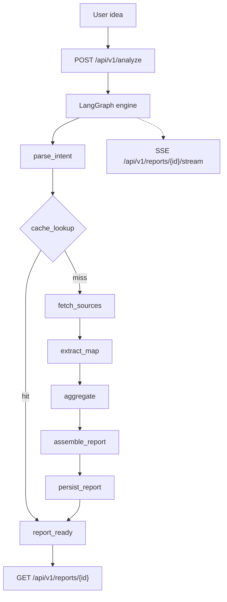

<div align="center">
  
</div>

# IdeaGo: AI-powered competitor research engine

**Most ideas die in the research phase. IdeaGo turns a sentence into an auditable competitor report with differentiation angles in minutes.**

[Quick Start](#-quick-start) · [Architecture](#-architecture) · [API Overview](#-api-overview) · [Configuration](#-configuration) · [简体中文](README_CN.md)

[](https://www.python.org/)
[](https://fastapi.tiangolo.com/)
[](https://react.dev/)
[](https://www.langchain.com/langgraph)
[](LICENSE)

> **[Screenshot Placeholder: IdeaGo main workflow demo GIF / video]**

---

## News

* **2026-03-25** **SaaS edition** in progress (`saas` branch): multi-tenant, billing, and user workspaces.
* **2026-03-20** **Supabase authentication** integrated (`feature/supabase-auth`), replacing the single API key model.
* **2026-03-15** **Source Intelligence V2**: decision-first reports (recommendation, pain, whitespace) before competitor lists.

---

## Why IdeaGo?

| **Pain** | **IdeaGo** |
| --- | --- |
| Manual research is slow | Multi-source retrieval (Tavily, GitHub, Reddit, HN) plus extraction and aggregation |
| LLMs invent competitors | **Link grounding**: every competitor maps to a fetched URL |
| Reports feel generic | **Decision-first**: `go` / `caution` / `no_go`, pain, whitespace, then the competitor matrix |
| Pipelines are opaque | **SSE progress**: intent → fetch → extract → aggregate, with cost and confidence |

---

## What you get

| Validate fast | Traceable links | Decision-first |
| --- | --- | --- |
| One sentence in, structured report out | Claims tied to sources, no anonymous side channels | Verdict and opportunities before competitors |

---

## How it works

| Pipeline | Sources |
| --- | --- |
| LangGraph: intent → cache → fetch → extract → aggregate → report | GitHub, Tavily, Hacker News, Reddit, App Store, Product Hunt |

| Resilience | Transparency |
| --- | --- |
| Retries, JSON recovery, endpoint failover, graceful degradation | Confidence, evidence, token/latency telemetry in every report |

---

## Quick Start

Pick **one** path below. **Docker** is for a one-command local run or deployment-shaped setup; **local development** is for backend/frontend changes with hot reload.

### Shared prerequisites (all paths)

* **Keys**: set at least `OPENAI_API_KEY` in `.env`. `TAVILY_API_KEY` is strongly recommended for web search quality.

---

### A) Docker

Best for: quick local tryout, or running without installing Python/Node on the host.

**Requirements**

* [Docker](https://docs.docker.com/get-docker/) and Docker Compose v2

**Steps**

```bash
cp .env.example .env
# Edit .env: set OPENAI_API_KEY (and optional keys such as TAVILY_API_KEY)

docker compose up --build -d
```

**Open**

* App: [http://localhost:8000](http://localhost:8000) (port follows `PORT` in `.env`, default `8000`)

**Notes**

* [`docker-compose.yml`](docker-compose.yml) builds from the repo [`Dockerfile`](Dockerfile) and loads `.env` via `env_file`.
* Do **not** set `APP_API_KEY` (removed). Keep secrets in runtime env only, not in image layers.

---

### B) Local development (hot reload)

Best for: editing `src/ideago` or `frontend/` with fast feedback.

**Requirements**

* Python **3.10+** and [uv](https://github.com/astral-sh/uv)
* Node.js **20+** and [pnpm](https://pnpm.io/)

**1) Install dependencies**

```bash
uv sync --all-extras
pnpm --prefix frontend install
```

**2) Environment**

```bash
cp .env.example .env
# Edit .env (minimum: OPENAI_API_KEY)
```

**3) Run backend and frontend in two terminals**

Terminal 1 — API (reload):

```bash
uv run uvicorn ideago.api.app:create_app --factory --reload --port 8000
```

Terminal 2 — Vite:

```bash
pnpm --prefix frontend dev
```

**Open**

* Frontend: [http://localhost:5173](http://localhost:5173)
* Health: [http://localhost:8000/api/v1/health](http://localhost:8000/api/v1/health)

---

### C) Optional: single-process local (backend serves built frontend)

Best for: one process, no Vite dev server — FastAPI serves the built SPA.

```bash
pnpm --prefix frontend build
uv run python -m ideago
```

**Open**

* [http://localhost:8000](http://localhost:8000)

---

## Architecture



### Runtime notes

* `POST /analyze` returns `report_id` immediately; work continues in the background.
* The UI subscribes to SSE for per-stage progress.
* In-flight duplicate requests for the same normalized query are deduplicated.
* In-memory rate limit on `POST /api/v1/analyze`: **10** requests per **60s** per IP/session key.

---

## API overview

Base path: `/api/v1`

| Method | Path | Description |
| --- | --- | --- |
| `POST` | `/analyze` | Start analysis; returns `report_id` |
| `GET` | `/health` | Health and source availability |
| `GET` | `/reports` | List reports (`limit`, `offset`) |
| `GET` | `/reports/{report_id}` | Get report (`202` while processing) |
| `GET` | `/reports/{report_id}/status` | Runtime status |
| `GET` | `/reports/{report_id}/stream` | SSE progress |
| `GET` | `/reports/{report_id}/export` | Export Markdown |
| `DELETE` | `/reports/{report_id}` | Delete report |
| `DELETE` | `/reports/{report_id}/cancel` | Cancel run |

**Example**

```bash
curl -X POST http://localhost:8000/api/v1/analyze \
  -H "Content-Type: application/json" \
  -d '{"query":"An AI assistant for indie game analytics"}'

curl -N http://localhost:8000/api/v1/reports/<report_id>/stream
```

---

## Configuration

Defaults: [`.env.example`](.env.example). Schema: [`src/ideago/config/settings.py`](src/ideago/config/settings.py).

| Variable | Required | Default | Purpose |
| --- | --- | --- | --- |
| `OPENAI_API_KEY` | Yes | `""` | LLM access |
| `OPENAI_MODEL` | No | `gpt-4o-mini` | Primary model |
| `OPENAI_FALLBACK_ENDPOINTS` | No | `""` | JSON array of fallback endpoints |
| `TAVILY_API_KEY` | Recommended | `""` | Tavily web search |
| `GITHUB_TOKEN` | No | `""` | Higher GitHub rate limits |
| `LANGGRAPH_MAX_RETRIES` | No | `2` | Retry budget |
| `CACHE_DIR` | No | `.cache/ideago` | Cache directory |
| `SUPABASE_URL` / `SUPABASE_ANON_KEY` | No | `""` | Supabase client |
| `CORS_ALLOW_ORIGINS` | No | `*` | Browser origins |

Full list (timeouts, concurrency, Reddit/Product Hunt, LinuxDo OAuth, etc.) is in `.env.example`.

---

## Security (after `APP_API_KEY` removal)

`APP_API_KEY` / `X-API-Key` is removed everywhere.

**Built-in**

* Rate limit on `POST /api/v1/analyze` (see Runtime notes).
* CORS via `CORS_ALLOW_ORIGINS` (avoid `*` on public deployments).
* FastAPI + Pydantic validation; sanitized errors to clients.

**Recommended for public hosts**

* Reverse proxy or API gateway (Nginx, Caddy, Cloudflare, Traefik).
* TLS at the edge; keep the backend on a private network.
* Secrets only in runtime env, never baked into images.

---

## Project structure

```text
.
├── src/ideago/          # FastAPI, LangGraph, sources, models
├── frontend/src/        # React 19 app
├── tests/               # Pytest
├── ai_docs/             # Engineering standards
└── docs/                # Design assets
```

---

## Tech stack

**Backend:** Python 3.10+, FastAPI, LangGraph, LangChain OpenAI, Pydantic v2, optional Supabase.

**Frontend:** React 19, TypeScript, Vite 7, Tailwind 4, React Router 7, i18next, Supabase JS, Framer Motion, Recharts.

---

## Development & quality

```bash
uv run ruff check src tests scripts
uv run ruff format --check src tests scripts
uv run mypy src
uv run pytest

pnpm --prefix frontend lint
pnpm --prefix frontend typecheck
pnpm --prefix frontend test
pnpm --prefix frontend build
```

See [CONTRIBUTING.md](CONTRIBUTING.md) and [ai_docs/AI_TOOLING_STANDARDS.md](ai_docs/AI_TOOLING_STANDARDS.md).

---

## License

MIT License. See [LICENSE](LICENSE).
