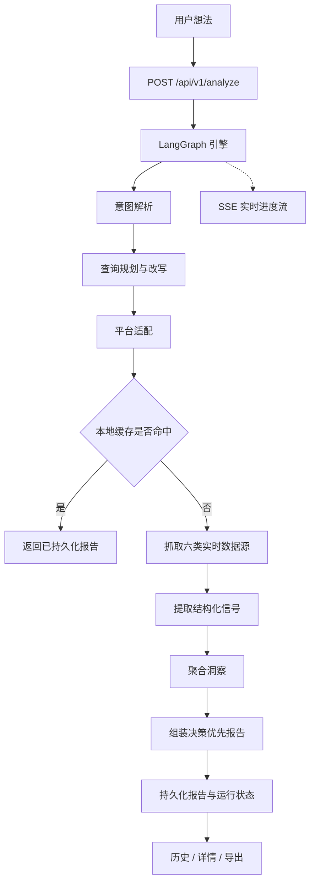

<div align="center">
  

  <h1>IdeaGo</h1>

  <p><strong>面向创业想法的决策优先型 Source Intelligence 工具。</strong></p>

  <p>
    IdeaGo 会把一条模糊的产品想法转成结构化验证报告，输出 recommendation、why-now、
    pain signals、commercial signals、whitespace opportunities、competitors、evidence 与 confidence。
  </p>

  <p>
    <a href="README.md">English</a> ·
    <a href="#快速开始">快速开始</a> ·
    <a href="#main-分支负责什么">分支范围</a> ·
    <a href="#工作原理">工作原理</a> ·
    <a href="DEPLOYMENT.md">部署说明</a> ·
    <a href="ai_docs/AI_TOOLING_STANDARDS.md">ai_docs</a>
  </p>

  <p>
    <a href="LICENSE"></a>
    
    
    
    
  </p>
</div>

---

## 项目概览

这份 README 描述的是 `main` 分支。

`main` 是 IdeaGo 的匿名与个人部署产品线。它和 `saas` 共用同一套 Source Intelligence V2
分析内核，但刻意去掉了托管产品需要的运行时能力：

- 不需要登录
- 没有 profile 系统
- 启动不依赖 Supabase
- 没有 admin 后台
- 没有 billing 和 pricing UI

如果你要的是带认证、数据归属、管理后台与 SaaS 部署行为的版本，请切换到 `saas` 分支。

## `main` 分支负责什么

### 当前产品契约

IdeaGo 现在已经不是单纯的竞品搜索流程。报告契约是决策优先的：

1. recommendation / why-now
2. pain signals
3. commercial signals
4. whitespace opportunities
5. competitors
6. evidence
7. confidence

### 当前运行面

- 匿名提交想法
- SSE 实时进度流
- 本地 file cache 保存报告历史
- 报告详情与 Markdown 导出
- 本地 SQLite 保存 LangGraph checkpoint
- 没有账户归属模型

### 当前路由面

- `/`
- `/reports`
- `/reports/:id`

仓库里虽然还有一些共享/法律页面文件，但 `main` 当前真正对外暴露的路由故意保持匿名且精简。

## 产品演示

### 落地页与想法输入


### 实时研究管线


### 决策摘要


### 证据化竞争格局


## 快速开始

### 前置要求

- Python 3.10+
- [uv](https://github.com/astral-sh/uv)
- Node.js 20+
- `pnpm`

最小必要密钥：

- `OPENAI_API_KEY`

推荐用于增强数据覆盖：

- `TAVILY_API_KEY`
- `GITHUB_TOKEN`
- `PRODUCTHUNT_DEV_TOKEN`
- `REDDIT_CLIENT_ID`
- `REDDIT_CLIENT_SECRET`

### 安装依赖

```bash
uv sync --all-extras
pnpm --prefix frontend install
```

### 配置环境变量

```bash
cp .env.example .env
cp frontend/.env.example frontend/.env
```

最小可运行配置：

- `OPENAI_API_KEY`

常用本地运行设置：

- `CACHE_DIR`
- `ANONYMOUS_CACHE_TTL_HOURS`
- `FILE_CACHE_MAX_ENTRIES`
- `LANGGRAPH_CHECKPOINT_DB_PATH`
- `CORS_ALLOW_ORIGINS`

`main` 的前端配置刻意保持很小：

- `VITE_API_BASE_URL`
- `VITE_SENTRY_DSN`

### 本地开发运行

终端 1：

```bash
uv run uvicorn ideago.api.app:create_app --factory --reload --port 8000
```

终端 2：

```bash
pnpm --prefix frontend dev
```

打开：

- 前端：[http://localhost:5173](http://localhost:5173)
- 后端健康检查：[http://localhost:8000/api/v1/health](http://localhost:8000/api/v1/health)

### 单进程本地运行

```bash
pnpm --prefix frontend build
uv run python -m ideago
```

打开：[http://localhost:8000](http://localhost:8000)

### Docker Compose

`main` 自带的 `docker-compose.yml` 默认会从 Docker Hub 拉取已发布镜像：

```bash
docker compose pull
docker compose up -d
```

如果想固定到某个发布版本，而不是 `latest`：

```bash
IDEAGO_IMAGE_TAG=0.3.8 docker compose up -d
```

如果你想自行构建，分支里也保留了 Dockerfile。

## 工作原理

IdeaGo 运行的是一条明确的 Source Intelligence V2 管线：

`intent_parser -> query_planning_rewriting -> platform_adaptation -> sources -> extractor -> aggregator`

最终生成的决策优先报告会被本地持久化，之后可以从历史里再次打开。



固定的数据源分工：

- Tavily：广覆盖召回
- Reddit：痛点与迁移语言
- GitHub：开源成熟度与生态信号
- Hacker News：builder sentiment
- App Store：评论聚类痛点
- Product Hunt：发布定位

## API 概览

`main` 分支公开 API：

- `POST /api/v1/analyze`
- `GET /api/v1/reports`
- `GET /api/v1/reports/{id}`
- `GET /api/v1/reports/{id}/status`
- `GET /api/v1/reports/{id}/stream`
- `GET /api/v1/reports/{id}/export`
- `DELETE /api/v1/reports/{id}`
- `DELETE /api/v1/reports/{id}/cancel`
- `GET /api/v1/health`

`main` 不暴露 auth、billing、profile、pricing、admin 相关 API。

## 配置说明

`main` 上比较重要的配置：

- `OPENAI_API_KEY`
- `OPENAI_MODEL`
- `TAVILY_API_KEY`
- `CACHE_DIR`
- `ANONYMOUS_CACHE_TTL_HOURS`
- `FILE_CACHE_MAX_ENTRIES`
- `LANGGRAPH_CHECKPOINT_DB_PATH`
- `CORS_ALLOW_ORIGINS`

Reddit 相关可选设置：

- `REDDIT_CLIENT_ID`
- `REDDIT_CLIENT_SECRET`
- `REDDIT_ENABLE_PUBLIC_FALLBACK`
- `REDDIT_PUBLIC_FALLBACK_LIMIT`
- `REDDIT_PUBLIC_FALLBACK_DELAY_SECONDS`

在 `main` 上，如果没有 Reddit OAuth，公开只读 fallback 默认可用。

## 项目结构

### 后端

- `src/ideago/api`：FastAPI app、路由、中间件、schema
- `src/ideago/cache`：本地报告持久化
- `src/ideago/config`：运行时配置
- `src/ideago/models`：领域模型与报告契约
- `src/ideago/pipeline`：编排、提取、聚合、报告组装
- `src/ideago/sources`：六类数据源接入

### 前端

- `frontend/src/app`：路由、壳层、导航、错误边界
- `frontend/src/features/home`：主搜索体验
- `frontend/src/features/history`：本地报告历史
- `frontend/src/features/reports`：报告详情与进度视图
- `frontend/src/lib/api`：typed API client 与 SSE
- `frontend/src/lib/i18n`：国际化
- `frontend/src/components/ui`：共享 UI primitive

## 分支模型

- `main`：匿名 / 个人部署产品线
- `saas`：托管 / 商业化产品线

同步规则：

- 通用产品能力先进 `main`
- `saas` 再合并 `main`
- 不要把托管版依赖重新带回 `main`

## 文档导航

- 核心工程契约：[ai_docs/AI_TOOLING_STANDARDS.md](ai_docs/AI_TOOLING_STANDARDS.md)
- 后端约定：[ai_docs/BACKEND_STANDARDS.md](ai_docs/BACKEND_STANDARDS.md)
- 前端约定：[ai_docs/FRONTEND_STANDARDS.md](ai_docs/FRONTEND_STANDARDS.md)
- 设置与环境变量：[ai_docs/SETTINGS_GUIDE.md](ai_docs/SETTINGS_GUIDE.md)
- 部署说明：[DEPLOYMENT.md](DEPLOYMENT.md)

## 验证命令

在宣称完成之前，按任务范围运行：

```bash
# Backend
uv run ruff check src tests scripts
uv run ruff format --check src tests scripts
uv run mypy src
uv run pytest

# Frontend
pnpm --prefix frontend lint
pnpm --prefix frontend typecheck
pnpm --prefix frontend test
pnpm --prefix frontend build
```
