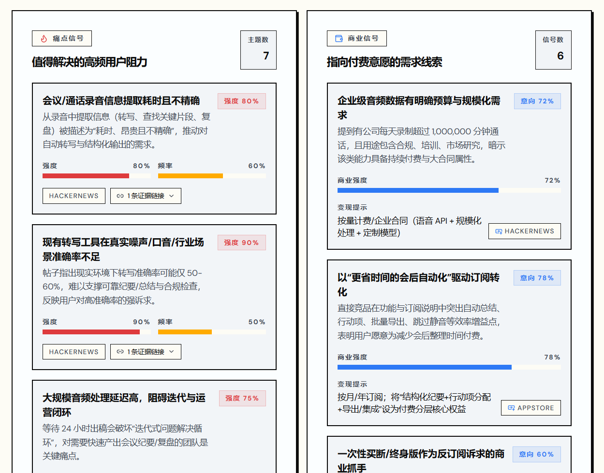
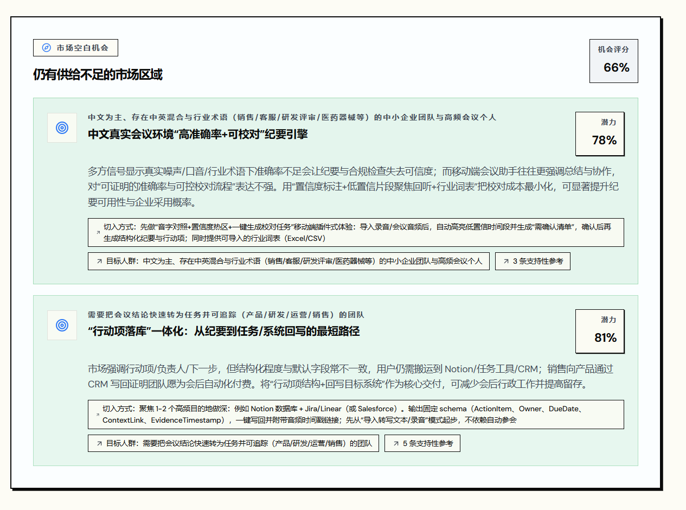
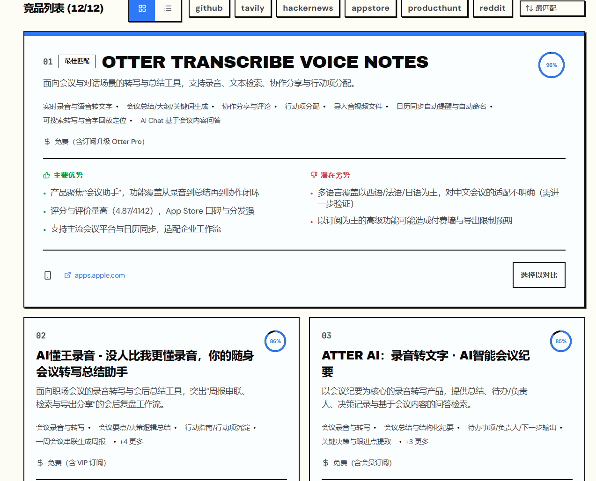
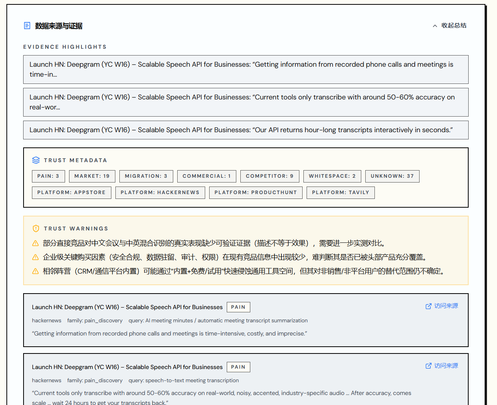
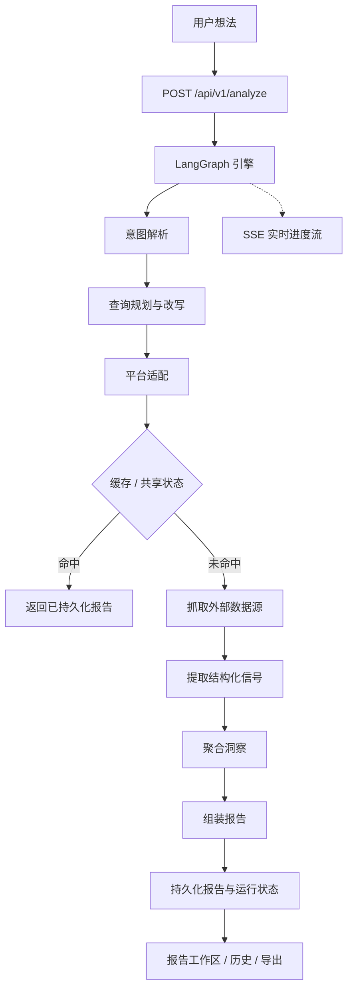

<div align="center">
  

  <h1>IdeaGo</h1>

  <p><strong>几分钟内，把一个粗糙的想法变成结构化验证报告。</strong></p>

  <p>
    IdeaGo 交叉比对 6 个实时数据源 — GitHub、Tavily、Hacker News、App Store、Product Hunt
    和 Reddit — 生成决策优先的报告，包含推荐结论、痛点信号、商业信号、空白机会、
    竞争格局、证据链和置信度评分。
  </p>

  <p>
    <a href="README.md">English</a> ·
    <a href="#快速开始">快速开始</a> ·
    <a href="#产品演示">产品演示</a> ·
    <a href="#工作原理">工作原理</a> ·
    <a href="DEPLOYMENT.md">部署说明</a>
  </p>

  <p>
    <a href="LICENSE"></a>
    
    
    
    
    
    <a href="ai_docs/AI_TOOLING_STANDARDS.md"></a>
  </p>
</div>

---

## 项目概览

多数创业想法验证止步于表面概述。IdeaGo 更进一步：它会告诉你一个想法现在是否值得做，
并用来自真实社区讨论、应用评论、开源活动和产品发布的结构化证据来支撑结论。

报告按决策价值排序 — 推荐结论在前，然后是痛点信号、商业信号、空白机会、竞品、
证据链和置信度评分。

这是托管版（`saas` 分支），支持用户认证、资料管理、配额和管理后台。
如果只需要本地匿名使用（无需 Supabase），请参阅 `main` 分支。

## 产品演示

### 描述你的想法

用自然语言输入产品想法。IdeaGo 提供快速建议，并展示历史报告方便随时查阅。


### 实时分析流水线

逐步展示分析进度：意图拆解、查询规划、6 个平台并行检索、信号提取、报告组装 —
全程通过 SSE 实时推送。


### 决策摘要

报告以最重要的信息开头：明确的推荐结论、机会评分、切入策略，以及痛点主题数、
商业指标数和空白缺口数。


### 市场背景与竞争格局

了解市场时机，通过交互式散点图查看现有玩家在功能完备度和市场存在感上的分布。


### 痛点信号与商业信号

痛点信号呈现真实用户的高频困扰，带强度和频率评分。商业信号标出付费意愿指标和
市场中的变现线索。



### 空白机会

识别现有产品覆盖不足的领域，每项机会附带潜力评分和支撑性证据引用。



### 竞品目录

浏览全部发现的竞品，按匹配度排序，支持按数据源筛选。每张卡片展示核心功能、
优劣势、定价和原始来源链接。



### 证据与信任元数据

每条结论都可追溯到源头证据。信任元数据为每条信息标注信号类型和来源平台，
信任警告会标记置信度有限的区域。



## 快速开始

### 前置要求

- Python 3.10+
- [uv](https://github.com/astral-sh/uv)
- Node.js 20+
- `pnpm`
- 一个 Supabase 项目
- OpenAI API 访问权限

如果要跑完整托管场景，推荐同时准备：

- Tavily API Key
- Stripe 账号与密钥
- Sentry DSN

### 安装依赖

```bash
uv sync --all-extras
pnpm --prefix frontend install
```

### 配置环境变量

```bash
cp .env.example .env
cp frontend/.env.example frontend/.env
```

最小可运行配置：

- `OPENAI_API_KEY`
- `SUPABASE_URL`
- `SUPABASE_ANON_KEY`
- `SUPABASE_SERVICE_ROLE_KEY`
- `AUTH_SESSION_SECRET`
- `FRONTEND_APP_URL`

前端认证相关变量：

- `VITE_SUPABASE_URL`
- `VITE_SUPABASE_ANON_KEY`
- `VITE_TURNSTILE_SITE_KEY`

对于 Docker 部署，这些 `VITE_*` 变量属于前端构建期输入。
必须在执行 `docker compose build` 或 `docker compose up --build` 之前提供，只有运行期容器环境变量是不够的。

Billing 对本地开发不是硬依赖，但如果要启用生产计费流，还需要：

- `STRIPE_SECRET_KEY`
- `STRIPE_WEBHOOK_SECRET`
- `STRIPE_PRO_PRICE_ID`

### 本地开发运行

终端 1：

```bash
uv run uvicorn ideago.api.app:create_app --factory --reload --port 8000
```

终端 2：

```bash
pnpm --prefix frontend dev
```

打开：

- 前端：[http://localhost:5173](http://localhost:5173)
- 后端健康检查：[http://localhost:8000/api/v1/health](http://localhost:8000/api/v1/health)

### 单进程本地运行

```bash
pnpm --prefix frontend build
uv run python -m ideago
```

打开：[http://localhost:8000](http://localhost:8000)

如果你要按接近线上环境的方式部署，请看 [DEPLOYMENT.md](DEPLOYMENT.md)。

## 工作原理

IdeaGo 接收一条想法，通过意图解析和查询规划进行标准化，然后从 6 个数据源并行采集证据，
提取结构化信号，组装决策优先的报告。托管版在这条管线外围包上认证、数据归属、配额与
管理后台能力。



数据源分工：

- **Tavily** — 广覆盖召回
- **Reddit** — 痛点与迁移语言
- **GitHub** — 开源成熟度与生态信号
- **Hacker News** — 开发者/建设者讨论氛围
- **App Store** — 评论聚类痛点
- **Product Hunt** — 发布定位与市场切入方式

## 托管版能力

托管版在核心分析引擎之上增加了运营能力：

- 基于 Supabase 的认证与用户身份
- LinuxDo OAuth 支持与自定义会话处理
- 用户资料与配额管理
- 面向管理员的用户管理、配额调整、指标与健康检查接口
- 基于 Supabase 的持久化与 PostgreSQL 共享运行时状态
- 用于 checkout、portal、webhook 的 Stripe 集成点
- Landing page、法律页面，以及托管产品路由

## API 概览

核心报告 API：

- `POST /api/v1/analyze`
- `GET /api/v1/reports`
- `GET /api/v1/reports/{id}`
- `GET /api/v1/reports/{id}/status`
- `GET /api/v1/reports/{id}/stream`
- `GET /api/v1/reports/{id}/export`
- `DELETE /api/v1/reports/{id}`
- `DELETE /api/v1/reports/{id}/cancel`
- `GET /api/v1/health`

认证相关 API：

- `GET /api/v1/auth/linuxdo/start`
- `GET /api/v1/auth/linuxdo/callback`
- `GET /api/v1/auth/me`
- `POST /api/v1/auth/refresh`
- `GET /api/v1/auth/quota`
- `GET /api/v1/auth/profile`
- `PUT /api/v1/auth/profile`
- `DELETE /api/v1/auth/account`

管理后台 API：

- `GET /api/v1/admin/users`
- `PATCH /api/v1/admin/users/{user_id}/quota`
- `GET /api/v1/admin/stats`
- `GET /api/v1/admin/metrics`
- `GET /api/v1/admin/health`

Billing API：

- `POST /api/v1/billing/checkout`
- `POST /api/v1/billing/portal`
- `GET /api/v1/billing/status`
- `POST /api/v1/billing/webhook`

## 配置说明

关键配置项：

- `SUPABASE_URL`
- `SUPABASE_ANON_KEY`
- `SUPABASE_SERVICE_ROLE_KEY`
- `SUPABASE_DB_URL`
- `AUTH_SESSION_SECRET`
- `AUTH_SESSION_EXPIRE_HOURS`
- `FRONTEND_APP_URL`
- `LINUXDO_CLIENT_ID`
- `LINUXDO_CLIENT_SECRET`
- `STRIPE_SECRET_KEY`
- `STRIPE_WEBHOOK_SECRET`
- `STRIPE_PRO_PRICE_ID`
- `SENTRY_DSN`

后端完整变量见 [`.env.example`](.env.example)，前端变量见 [`frontend/.env.example`](frontend/.env.example)。

## 项目结构

```text
.
├── src/ideago/          # API、auth、billing、pipeline、cache、models、sources
├── frontend/src/        # React 前端，含 landing、auth、profile、pricing、admin、reports
├── supabase/migrations/ # 数据库迁移
├── ai_docs/             # 项目规范与说明
├── docs/assets/         # README 截图素材
└── DEPLOYMENT.md        # 部署说明
```

## 分支模型

- `main`：本地 / 个人部署版，匿名使用，不依赖 Supabase
- `saas`：托管产品线，增加 auth、billing、profile、admin 与运营配置

通用产品能力先进 `main`，`saas` 再合并 `main`。

## 文档入口

- [部署说明](DEPLOYMENT.md)
- [贡献指南](CONTRIBUTING.md)
- [AI Tooling Standards](ai_docs/AI_TOOLING_STANDARDS.md)
- [Backend Standards](ai_docs/BACKEND_STANDARDS.md)
- [Frontend Standards](ai_docs/FRONTEND_STANDARDS.md)

## 验证命令

```bash
uv run ruff check src tests scripts
uv run ruff format --check src tests scripts
uv run mypy src
uv run pytest

pnpm --prefix frontend lint
pnpm --prefix frontend typecheck
pnpm --prefix frontend test
pnpm --prefix frontend build
```

## 许可证

MIT，见 [LICENSE](LICENSE)。
