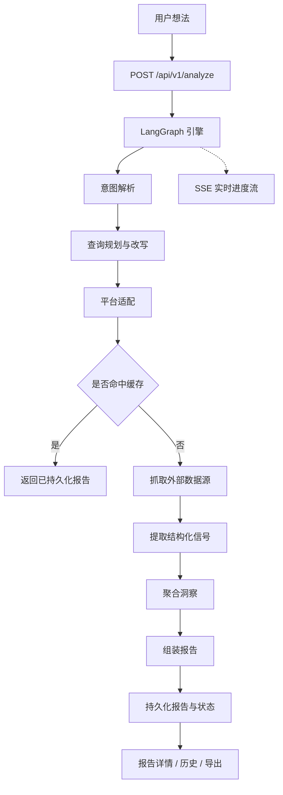

<div align="center">
  

  <h1>IdeaGo</h1>

  <p><strong>几分钟内，把一个粗糙的想法变成结构化验证报告。</strong></p>

  <p>
    IdeaGo 交叉比对 6 个实时数据源 — GitHub、Tavily、Hacker News、App Store、Product Hunt
    和 Reddit — 生成决策优先的报告，包含推荐结论、痛点信号、商业信号、空白机会、
    竞争格局、证据链和置信度评分。
  </p>

  <p>
    <a href="README.md">English</a> ·
    <a href="#快速开始">快速开始</a> ·
    <a href="#产品演示">产品演示</a> ·
    <a href="#工作原理">工作原理</a> ·
    <a href="DEPLOYMENT.md">部署说明</a> ·
    <a href="#致谢">致谢</a>
  </p>

  <p>
    <a href="LICENSE"></a>
    
    
    
    
    <a href="ai_docs/AI_TOOLING_STANDARDS.md"></a>
  </p>
</div>

---

## 项目概览

多数创业想法验证止步于表面概述。IdeaGo 更进一步：它会告诉你一个想法现在是否值得做，
并用来自真实社区讨论、应用评论、开源活动和产品发布的结构化证据来支撑结论。

报告按决策价值排序 — 推荐结论在前，然后是痛点信号、商业信号、空白机会、竞品、
证据链和置信度评分。

本版本可在本地运行，无需登录。带认证和计费功能的托管版请参阅 `saas` 分支。

## 产品演示

### 描述你的想法

用自然语言输入产品想法。IdeaGo 提供快速建议，并展示历史报告方便随时查阅。


### 实时分析流水线

逐步展示分析进度：意图拆解、查询规划、6 个平台并行检索、信号提取、报告组装 —
全程通过 SSE 实时推送。


### 决策摘要

报告以最重要的信息开头：明确的推荐结论、机会评分、切入策略，以及痛点主题数、
商业指标数和空白缺口数。


### 市场背景与竞争格局

了解市场时机，通过交互式散点图查看现有玩家在功能完备度和市场存在感上的分布。


### 痛点信号与商业信号

痛点信号呈现真实用户的高频困扰，带强度和频率评分。商业信号标出付费意愿指标和
市场中的变现线索。


### 空白机会

识别现有产品覆盖不足的领域，每项机会附带潜力评分和支撑性证据引用。


### 竞品目录

浏览全部发现的竞品，按匹配度排序，支持按数据源筛选。每张卡片展示核心功能、
优劣势、定价和原始来源链接。


### 证据与信任元数据

每条结论都可追溯到源头证据。信任元数据为每条信息标注信号类型和来源平台，
信任警告会标记置信度有限的区域。


## 功能特性

- 匿名使用，无需登录
- 通过本地文件缓存保留历史报告
- 报告详情页和 Markdown 导出
- SSE 实时推送分析流水线进度
- 本地 SQLite 保存 LangGraph 运行时 checkpoint
- 支持 Docker Compose 部署

## 快速开始

### 前置要求

- Python 3.10+
- [uv](https://github.com/astral-sh/uv)
- Node.js 20+
- `pnpm`

### 安装依赖

```bash
uv sync --all-extras
pnpm --prefix frontend install
```

### 配置环境变量

```bash
cp .env.example .env
cp frontend/.env.example frontend/.env
```

最小可用配置：

- 必需：`OPENAI_API_KEY`
- 推荐：`TAVILY_API_KEY`

其余默认值已经写在 [`.env.example`](.env.example)。

### 本地开发运行

终端 1：

```bash
uv run uvicorn ideago.api.app:create_app --factory --reload --port 8000
```

终端 2：

```bash
pnpm --prefix frontend dev
```

打开：

- 前端：[http://localhost:5173](http://localhost:5173)
- 后端健康检查：[http://localhost:8000/api/v1/health](http://localhost:8000/api/v1/health)

### 单进程本地运行

```bash
pnpm --prefix frontend build
uv run python -m ideago
```

打开：[http://localhost:8000](http://localhost:8000)

### 使用 Docker Compose 运行（远端镜像）

默认的 `docker-compose.yml` 会使用已发布的 Docker Hub 镜像（`simonsun3/ideago`）。

```bash
cp .env.example .env
docker compose pull
docker compose up -d
```

可选：固定到某个发布版本，而不是 `latest`：

```bash
IDEAGO_IMAGE_TAG=0.3.8 docker compose up -d
```

验证：

```bash
curl http://localhost:8000/api/v1/health
```

## 工作原理

IdeaGo 接收一条想法，通过意图解析和查询规划进行标准化，然后从 6 个数据源并行采集证据，
提取结构化信号，组装决策优先的报告。报告可随时从历史记录中重新打开。



数据源分工：

- **Tavily** — 广覆盖召回
- **Reddit** — 痛点与迁移语言
- **GitHub** — 开源成熟度与生态信号
- **Hacker News** — 开发者/建设者讨论氛围
- **App Store** — 评论聚类痛点
- **Product Hunt** — 发布定位与市场切入方式

## API 概览

- `POST /api/v1/analyze`
- `GET /api/v1/reports`
- `GET /api/v1/reports/{id}`
- `GET /api/v1/reports/{id}/status`
- `GET /api/v1/reports/{id}/stream`
- `GET /api/v1/reports/{id}/export`
- `DELETE /api/v1/reports/{id}`
- `DELETE /api/v1/reports/{id}/cancel`
- `GET /api/v1/health`

## 配置说明

关键配置项：

- `OPENAI_API_KEY`
- `OPENAI_MODEL`
- `TAVILY_API_KEY`
- `CACHE_DIR`
- `ANONYMOUS_CACHE_TTL_HOURS`
- `FILE_CACHE_MAX_ENTRIES`
- `LANGGRAPH_CHECKPOINT_DB_PATH`
- `CORS_ALLOW_ORIGINS`

Reddit 相关可选配置：

- `REDDIT_CLIENT_ID`
- `REDDIT_CLIENT_SECRET`

如果没有 Reddit OAuth 凭据，只要 `REDDIT_ENABLE_PUBLIC_FALLBACK=true`，仍然可以退化到公开只读抓取。

## 项目结构

```text
.
├── src/ideago/          # FastAPI 应用、LangGraph 管线、数据源、模型
├── frontend/src/        # React 前端
├── tests/               # 后端测试
├── ai_docs/             # 项目规范与说明
├── docs/assets/         # README 截图素材
└── DEPLOYMENT.md        # 部署说明
```

## 文档入口

- [部署说明](DEPLOYMENT.md)
- [AI Tooling Standards](ai_docs/AI_TOOLING_STANDARDS.md)
- [Backend Standards](ai_docs/BACKEND_STANDARDS.md)
- [Frontend Standards](ai_docs/FRONTEND_STANDARDS.md)
- [Settings Guide](ai_docs/SETTINGS_GUIDE.md)

## 验证命令

```bash
uv run ruff check src tests scripts
uv run ruff format --check src tests scripts
uv run mypy src
uv run pytest

pnpm --prefix frontend lint
pnpm --prefix frontend typecheck
pnpm --prefix frontend test
pnpm --prefix frontend build
```

## 致谢

感谢 [Linux.do](https://linux.do/) 提供的参考资料。

## 许可证

MIT，见 [LICENSE](LICENSE)。
