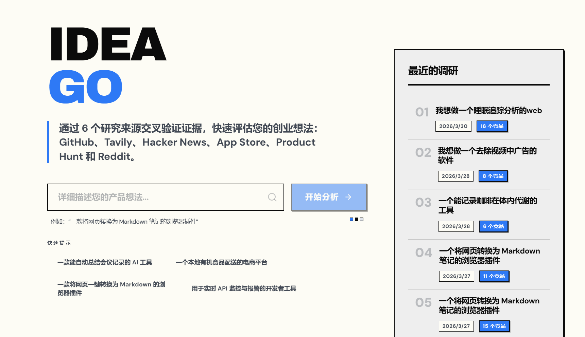
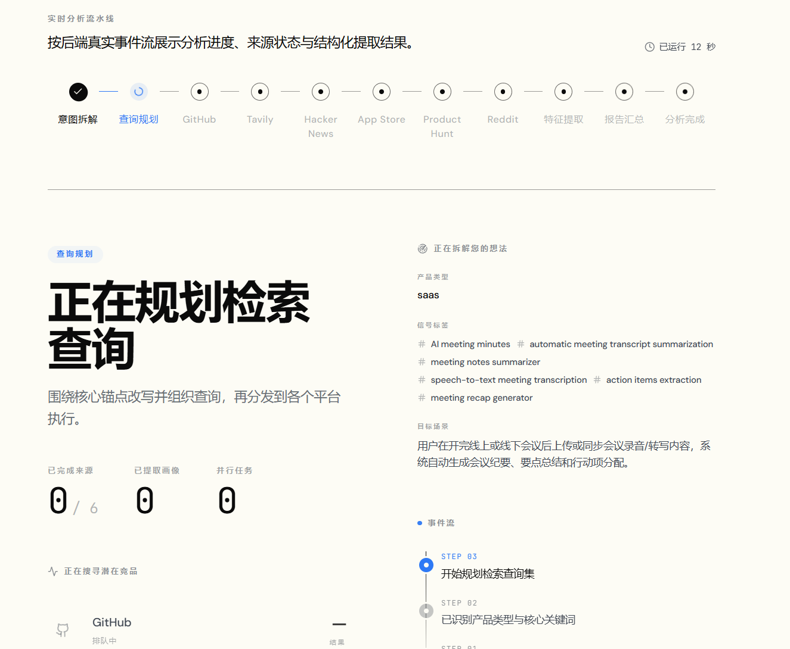
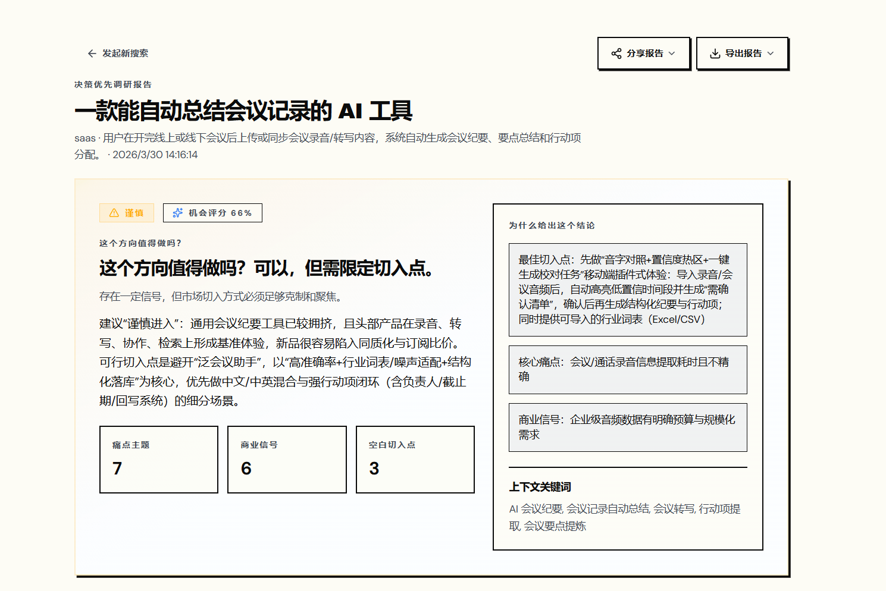
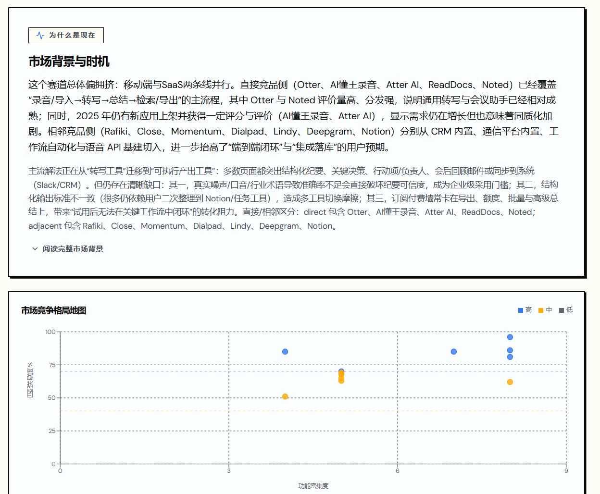
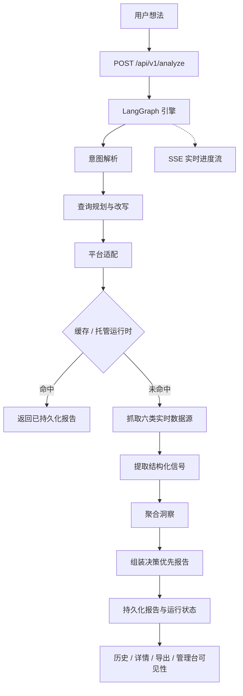

<div align="center">
  

  <h1>IdeaGo</h1>

  <p><strong>面向托管产品的创意验证 Source Intelligence 系统。</strong></p>

  <p>
    IdeaGo 会把一条模糊的产品想法转换成决策优先的验证报告，并用 Tavily、Reddit、GitHub、
    Hacker News、App Store、Product Hunt 六类实时证据支撑结论。
  </p>

  <p>
    <a href="README.md">English</a> ·
    <a href="#快速开始">快速开始</a> ·
    <a href="#saas-分支负责什么">分支范围</a> ·
    <a href="#工作原理">工作原理</a> ·
    <a href="DEPLOYMENT.md">部署说明</a> ·
    <a href="frontend/README.md">前端说明</a> ·
    <a href="ai_docs/AI_TOOLING_STANDARDS.md">ai_docs</a>
  </p>

  <p>
    <a href="LICENSE"></a>
    
    
    
    
    
  </p>
</div>

---

## 项目概览

这份 README 描述的是 `saas` 分支。

`saas` 是 IdeaGo 的托管/商业化版本。它保留了与 `main` 相同的 Source Intelligence V2
分析内核，并在其上增加：

- 基于 Supabase 的认证与数据归属
- 邮箱密码与 Supabase OAuth 登录
- LinuxDo OAuth 与后端管理的 session cookie
- 用户配额、资料、账户管理
- 管理后台与运营 API
- Supabase 持久化、共享运行时状态、PostgREST 速率限制
- Landing page 与法律页面

如果你需要不带账号体系、适合个人部署的匿名版本，请切换到 `main` 分支。

## `saas` 分支负责什么

### 当前产品契约

IdeaGo 已经不是单纯的竞品搜索工具。报告契约是决策优先的：

1. recommendation / why-now
2. pain signals
3. commercial signals
4. whitespace opportunities
5. competitors
6. evidence
7. confidence

竞品发现仍然重要，但它只是更大验证报告中的一个章节。

### 当前托管版能力

- 公共路由：landing、login、auth callback、法律页面
- 登录后路由：home 工作区、报告历史、报告详情、profile
- 管理员路由：`/admin`
- API 家族：`analyze`、`reports`、`auth`、`admin`、`billing`、`health`
- 报告持久化：`ReportRepository` 抽象，底层可用 file cache 与 Supabase
- 运行时状态：SQLite checkpoint + 托管共享运行时
- 进度更新：SSE

### Billing 当前状态

Stripe 代码链路已经存在，但对用户的定价入口目前是故意隐藏的：

- 前端 `PRICING_ENABLED` 现在是 `false`
- SPA 不暴露 `/pricing`
- `POST /api/v1/billing/checkout`
- `POST /api/v1/billing/portal`
- `GET /api/v1/billing/status`

这些用户侧 billing 接口现在会返回临时不可用的 not-found 响应，只有明确恢复定价流程时才应重新开放。

## 产品演示

### Landing 与想法输入

未登录用户先看到营销页；已登录用户直接进入产品工作区提交想法并开始分析。



### 实时研究流水线

分析过程会实时展示：意图解析、查询规划、平台适配、多源抓取、信号提取、聚合和报告组装。



### 决策摘要

报告最先展示 recommendation、why-now、机会分以及高层级信号数量。



### 证据驱动的报告工作区

托管版报告页包含历史记录、竞品详情、信任元数据、图表与原始证据。



## 快速开始

### 前置要求

- Python 3.10+
- [uv](https://github.com/astral-sh/uv)
- Node.js 20+
- `pnpm`
- 一个 Supabase 项目
- 一个 OpenAI API Key

推荐同时准备：

- Tavily API Key
- Cloudflare Turnstile site key 与 secret key
- GitHub Token
- Product Hunt Token
- Reddit OAuth 凭据
- Sentry DSN

当前属于可选集成，但代码已接好：

- Stripe 密钥、Webhook Secret、Price ID
- LinuxDo OAuth 客户端凭据

### 安装依赖

```bash
uv sync --all-extras
pnpm --prefix frontend install
```

### 配置环境变量

```bash
cp .env.example .env
cp frontend/.env.example frontend/.env
```

托管版最小后端配置：

- `OPENAI_API_KEY`
- `SUPABASE_URL`
- `SUPABASE_ANON_KEY`
- `SUPABASE_SERVICE_ROLE_KEY`
- `SUPABASE_DB_URL`
- `AUTH_SESSION_SECRET`
- `FRONTEND_APP_URL`
- `TURNSTILE_SECRET_KEY`

前端最小构建/运行配置：

- `VITE_SUPABASE_URL`
- `VITE_SUPABASE_ANON_KEY`
- `VITE_TURNSTILE_SITE_KEY`

可选认证增强：

- 在 Supabase 后台启用 GitHub / Google provider
- `LINUXDO_CLIENT_ID`
- `LINUXDO_CLIENT_SECRET`

可选监控与 billing：

- `SENTRY_DSN`
- `VITE_SENTRY_DSN`
- `STRIPE_SECRET_KEY`
- `STRIPE_WEBHOOK_SECRET`
- `STRIPE_PRO_PRICE_ID`

如果你走 Docker 构建，`VITE_*` 是构建期输入，必须在 `docker compose build` 或
`docker compose up --build` 前提供。

### 本地开发运行

终端 1：

```bash
uv run uvicorn ideago.api.app:create_app --factory --reload --port 8000
```

终端 2：

```bash
pnpm --prefix frontend dev
```

打开：

- 前端：[http://localhost:5173](http://localhost:5173)
- 后端健康检查：[http://localhost:8000/api/v1/health](http://localhost:8000/api/v1/health)

### 单进程本地运行

```bash
pnpm --prefix frontend build
uv run python -m ideago
```

打开：[http://localhost:8000](http://localhost:8000)

### Docker Compose

`saas` 分支的 `docker-compose.yml` 会基于当前仓库构建本地镜像，并把前端构建需要的参数透传到镜像构建阶段。

```bash
docker compose build
docker compose up -d
```

完整托管部署流程请看 [DEPLOYMENT.md](DEPLOYMENT.md)。

## 工作原理

IdeaGo 运行的是明确的 Source Intelligence V2 管线：

`intent_parser -> query_planning_rewriting -> platform_adaptation -> sources -> extractor -> aggregator`

托管版在这条分析管线外侧再包上认证、配额、持久化归属、管理后台与会话处理。



固定的数据源分工：

- Tavily：广覆盖召回
- Reddit：痛点与迁移语言
- GitHub：开源成熟度与生态信号
- Hacker News：builder sentiment
- App Store：评论聚类痛点
- Product Hunt：发布定位

## 认证与用户模型

托管版当前支持：

- Supabase 邮箱密码登录
- Supabase OAuth，例如 GitHub、Google
- LinuxDo OAuth，通过后端 callback 与 HTTP-only cookie 建立会话

用户账户相关能力包括：

- 通过 `/api/v1/auth/me` 做当前用户引导
- 通过 `/api/v1/auth/quota` 查看配额
- 通过 `/api/v1/auth/profile` 编辑资料
- 通过 `/api/v1/auth/account` 删除账户

## API 概览

### 分析与报告

- `POST /api/v1/analyze`
- `GET /api/v1/reports`
- `GET /api/v1/reports/{id}`
- `GET /api/v1/reports/{id}/status`
- `GET /api/v1/reports/{id}/stream`
- `GET /api/v1/reports/{id}/export`
- `DELETE /api/v1/reports/{id}`
- `DELETE /api/v1/reports/{id}/cancel`
- `GET /api/v1/health`

### Auth

- `POST /api/v1/auth/linuxdo/start`
- `GET /api/v1/auth/linuxdo/callback`
- `GET /api/v1/auth/me`
- `POST /api/v1/auth/refresh`
- `POST /api/v1/auth/logout`
- `GET /api/v1/auth/quota`
- `GET /api/v1/auth/profile`
- `PUT /api/v1/auth/profile`
- `DELETE /api/v1/auth/account`

### Admin

- `GET /api/v1/admin/users`
- `PATCH /api/v1/admin/users/{user_id}/quota`
- `GET /api/v1/admin/stats`
- `GET /api/v1/admin/metrics`
- `GET /api/v1/admin/health`

### Billing 集成

- `POST /api/v1/billing/checkout`
- `POST /api/v1/billing/portal`
- `GET /api/v1/billing/status`
- `POST /api/v1/billing/webhook`

注意：checkout、portal、status 现在仍是“代码已接好、用户入口未开放”的状态。

## 项目结构

### 后端

- `src/ideago/api`：FastAPI app、路由、中间件、schema、依赖注入
- `src/ideago/auth`：认证依赖、session helper、Supabase 管理接口
- `src/ideago/billing`：Stripe 集成层
- `src/ideago/cache`：file / Supabase 报告仓储
- `src/ideago/config`：运行时配置
- `src/ideago/models`：领域模型与报告契约
- `src/ideago/pipeline`：编排、提取、聚合、报告组装
- `src/ideago/sources`：六类数据源接入

### 前端

- `frontend/src/app`：路由、壳层、导航、错误边界
- `frontend/src/features/auth`：登录与回调流程
- `frontend/src/features/history`：报告历史
- `frontend/src/features/home`：登录后的主工作区
- `frontend/src/features/landing`：访客入口页
- `frontend/src/features/profile`：用户资料与订阅状态
- `frontend/src/features/reports`：报告详情与进度 UI
- `frontend/src/features/admin`：管理后台
- `frontend/src/lib/api`：typed API client 与 SSE
- `frontend/src/lib/auth`：auth context、redirect helper、token/session 处理

## 文档导航

- 核心工程契约：[ai_docs/AI_TOOLING_STANDARDS.md](ai_docs/AI_TOOLING_STANDARDS.md)
- 后端约定：[ai_docs/BACKEND_STANDARDS.md](ai_docs/BACKEND_STANDARDS.md)
- 前端约定：[ai_docs/FRONTEND_STANDARDS.md](ai_docs/FRONTEND_STANDARDS.md)
- 设置与环境变量：[ai_docs/SETTINGS_GUIDE.md](ai_docs/SETTINGS_GUIDE.md)
- 前端专属说明：[frontend/README.md](frontend/README.md)
- 部署 runbook：[DEPLOYMENT.md](DEPLOYMENT.md)
- 贡献指南：[CONTRIBUTING.md](CONTRIBUTING.md)

## 验证命令

在宣称完成之前，按任务范围运行：

```bash
# Backend
uv run ruff check src tests scripts
uv run ruff format --check src tests scripts
uv run mypy src
uv run pytest

# Frontend
pnpm --prefix frontend lint
pnpm --prefix frontend typecheck
pnpm --prefix frontend test
pnpm --prefix frontend build
```
