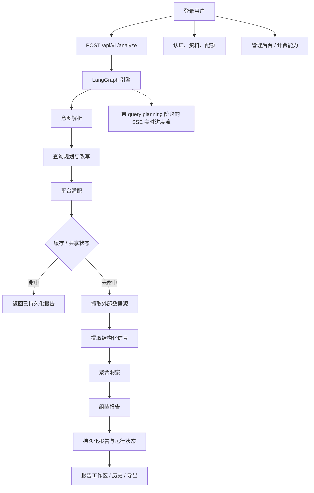

<div align="center">
  

  <h1>IdeaGo</h1>

  <p><strong>面向托管产品与运营场景的 Source Intelligence SaaS 分支。</strong></p>

  <p>
    <code>saas</code> 分支在同一套决策优先报告引擎之上，补齐了登录、资料、配额、后台、
    持久化与商业化部署所需的能力。
  </p>

  <p>
    <a href="README.md">English</a> ·
    <a href="#快速开始">快速开始</a> ·
    <a href="#saas-能力">SaaS 能力</a> ·
    <a href="#工作原理">工作原理</a> ·
    <a href="DEPLOYMENT.md">部署说明</a>
  </p>

  <p>
    <a href="LICENSE"></a>
    
    
    
    
    
    <a href="ai_docs/AI_TOOLING_STANDARDS.md"></a>
  </p>
</div>

---

## 项目概览

这份 README 对应的是 `saas` 分支。

它和 `main` 使用同一套 Source Intelligence V2 核心分析管线，但额外补上了托管产品真正需要的部分：
用户身份、资料与配额、管理端、Supabase 持久化，以及更接近线上环境的部署要求。

如果你要的是更轻量的本地部署 / 个人部署版本，请切回 `main` 分支。

## 截图占位

> 下面的位置已经为 SaaS 版截图预留好，后续可以直接替换。

### Hero 截图


`[占位] 建议替换为 SaaS 首页或登录后的主流程截图。`

### 工作区截图


`[占位] 建议替换为登录后的报告工作区、历史页或报告详情截图。`

### Admin / 账户截图

`[占位] 这里可以补 profile、quota、billing 或 admin 后台截图。`

## 为什么需要 `saas` 分支

`main` 分支是刻意保持轻量的。`saas` 分支则是在同一套分析引擎之上，把一个可托管产品所需的身份、
权限、数据归属和运营能力补齐。

它仍然遵守同一份报告契约：

- recommendation and why-now
- pain signals
- commercial signals
- whitespace opportunities
- competitors
- evidence
- confidence

多出来的部分是产品运营能力，不是改掉报告的核心顺序。

## SaaS 能力

相对于 `main`，`saas` 分支增加了：

- 基于 Supabase 的认证与用户身份
- LinuxDo OAuth 支持与自定义会话处理
- 用户 profile 与 quota 接口
- 面向管理员的用户、配额、指标、健康检查接口
- 基于 Supabase 的持久化与共享状态
- 用于 checkout、portal、webhook 的 Stripe 集成点
- landing page、法律页面，以及托管产品需要的前端路由

当前实现状态说明：

- 计费基础设施已经在这个分支上
- 但前端 pricing UI 目前仍通过 `frontend/src/lib/featureFlags.ts` 关闭

核心数据源仍然包括：

- Tavily
- Reddit
- GitHub
- Hacker News
- App Store
- Product Hunt

## 快速开始

### 前置要求

- Python 3.10+
- [uv](https://github.com/astral-sh/uv)
- Node.js 20+
- `pnpm`
- 一个 Supabase 项目
- OpenAI API 访问权限

如果要跑完整托管场景，推荐同时准备：

- Tavily API Key
- Stripe 账号与密钥
- Sentry DSN

### 安装依赖

```bash
uv sync --all-extras
pnpm --prefix frontend install
```

### 配置环境变量

```bash
cp .env.example .env
cp frontend/.env.example frontend/.env
```

`saas` 分支最小可运行配置：

- `OPENAI_API_KEY`
- `SUPABASE_URL`
- `SUPABASE_ANON_KEY`
- `SUPABASE_SERVICE_ROLE_KEY`
- `AUTH_SESSION_SECRET`
- `FRONTEND_APP_URL`

前端认证相关变量：

- `VITE_SUPABASE_URL`
- `VITE_SUPABASE_ANON_KEY`
- `VITE_TURNSTILE_SITE_KEY`

对于 Docker 部署，这些 `VITE_*` 变量属于前端构建期输入。
必须在执行 `docker compose build` 或 `docker compose up --build` 之前提供，只有运行期容器环境变量是不够的。

Billing 对本地开发不是硬依赖，但如果要启用生产计费流，还需要：

- `STRIPE_SECRET_KEY`
- `STRIPE_WEBHOOK_SECRET`
- `STRIPE_PRO_PRICE_ID`

### 本地开发运行

终端 1：

```bash
uv run uvicorn ideago.api.app:create_app --factory --reload --port 8000
```

终端 2：

```bash
pnpm --prefix frontend dev
```

打开：

- 前端：[http://localhost:5173](http://localhost:5173)
- 后端健康检查：[http://localhost:8000/api/v1/health](http://localhost:8000/api/v1/health)

### 单进程本地运行

```bash
pnpm --prefix frontend build
uv run python -m ideago
```

打开：[http://localhost:8000](http://localhost:8000)

如果你要按接近线上环境的方式部署，请看 [DEPLOYMENT.md](DEPLOYMENT.md)。

## 工作原理

分析引擎本身仍然是决策优先，但检索链路已经明确升级为：
`intent_parser -> query_planning_rewriting -> platform_adaptation -> sources -> extractor -> aggregator`。
在 `saas` 分支里，这条链路外围再包上用户身份、数据归属、配额与后台运营能力。



`saas` 分支的运行模型：

- 认证后的分析流程
- source 抓取前会先经过显式的 query planning 进度阶段
- 受保护的报告详情与历史页面
- profile 与 quota 管理
- 管理员后台与运维接口
- 基于 Supabase 的用户数据与共享持久化
- 支持 PostgreSQL checkpoint 的分布式运行时状态

托管版依然保持固定的数据源分工：

- Tavily：广覆盖召回
- Reddit：痛点与迁移语言
- GitHub：开源成熟度与生态信号
- Hacker News：开发者/建设者讨论氛围
- App Store：评论聚类痛点
- Product Hunt：发布定位与市场切入方式

## API 概览

核心报告 API：

- `POST /api/v1/analyze`
- `GET /api/v1/reports`
- `GET /api/v1/reports/{id}`
- `GET /api/v1/reports/{id}/status`
- `GET /api/v1/reports/{id}/stream`
- `GET /api/v1/reports/{id}/export`
- `DELETE /api/v1/reports/{id}`
- `DELETE /api/v1/reports/{id}/cancel`
- `GET /api/v1/health`

认证相关 API：

- `GET /api/v1/auth/linuxdo/start`
- `GET /api/v1/auth/linuxdo/callback`
- `GET /api/v1/auth/me`
- `POST /api/v1/auth/refresh`
- `GET /api/v1/auth/quota`
- `GET /api/v1/auth/profile`
- `PUT /api/v1/auth/profile`
- `DELETE /api/v1/auth/account`

管理后台 API：

- `GET /api/v1/admin/users`
- `PATCH /api/v1/admin/users/{user_id}/quota`
- `GET /api/v1/admin/stats`
- `GET /api/v1/admin/metrics`
- `GET /api/v1/admin/health`

本分支上的 Billing API：

- `POST /api/v1/billing/checkout`
- `POST /api/v1/billing/portal`
- `GET /api/v1/billing/status`
- `POST /api/v1/billing/webhook`

当前行为说明：

- billing 路由已经存在
- 但面向用户的 checkout / portal 流程目前仍被刻意隐藏，等待 pricing 重新开放

## 配置说明

SaaS 版最关键的配置项：

- `SUPABASE_URL`
- `SUPABASE_ANON_KEY`
- `SUPABASE_SERVICE_ROLE_KEY`
- `SUPABASE_DB_URL`
- `AUTH_SESSION_SECRET`
- `AUTH_SESSION_EXPIRE_HOURS`
- `FRONTEND_APP_URL`
- `LINUXDO_CLIENT_ID`
- `LINUXDO_CLIENT_SECRET`
- `STRIPE_SECRET_KEY`
- `STRIPE_WEBHOOK_SECRET`
- `STRIPE_PRO_PRICE_ID`
- `SENTRY_DSN`

后端完整变量见 [`.env.example`](.env.example)，前端变量见 [`frontend/.env.example`](frontend/.env.example)。

## 分支模型

- `main`：本地 / 个人部署版，匿名使用，不依赖 Supabase
- `saas`：托管产品线，增加 auth、billing 集成点、profile、admin 与 SaaS 专属配置

长期同步规则：

- 通用产品能力先进 `main`
- `saas` 再合并 `main`
- SaaS 专属运行时依赖留在 `saas`

## 项目结构

```text
.
├── src/ideago/          # API、auth、billing、pipeline、cache、models、sources
├── frontend/src/        # React 前端，含 landing、auth、profile、pricing、admin、reports
├── supabase/migrations/ # SaaS 数据库迁移
├── ai_docs/             # 项目规范与说明
├── docs/assets/         # saas 分支 README 使用的素材
└── DEPLOYMENT.md        # SaaS 部署说明
```

值得关注的 SaaS 区域：

- `src/ideago/auth`
- `src/ideago/billing`
- `src/ideago/api/routes/auth.py`
- `src/ideago/api/routes/admin.py`
- `frontend/src/features/auth`
- `frontend/src/features/profile`
- `frontend/src/features/admin`
- `supabase/migrations`

## 文档入口

- [部署说明](DEPLOYMENT.md)
- [贡献指南](CONTRIBUTING.md)
- [AI Tooling Standards](ai_docs/AI_TOOLING_STANDARDS.md)
- [Backend Standards](ai_docs/BACKEND_STANDARDS.md)
- [Frontend Standards](ai_docs/FRONTEND_STANDARDS.md)

## 验证命令

```bash
uv run ruff check src tests scripts
uv run ruff format --check src tests scripts
uv run mypy src
uv run pytest

pnpm --prefix frontend lint
pnpm --prefix frontend typecheck
pnpm --prefix frontend test
pnpm --prefix frontend build
```

## 常见问题

### 这和 `main` 一样吗？

不一样。`main` 是匿名、本地部署路线；`saas` 是面向托管产品的完整运行线。

### `saas` 一定需要 Supabase 吗？

需要。认证流和运营数据模型都依赖 Supabase 配置。

### 计费 UI 已经完全开放了吗？

还没有。计费集成点已经在这个分支里，但 pricing UI 目前仍处于 feature flag 关闭状态。

## 许可证

MIT，见 [LICENSE](LICENSE)。
