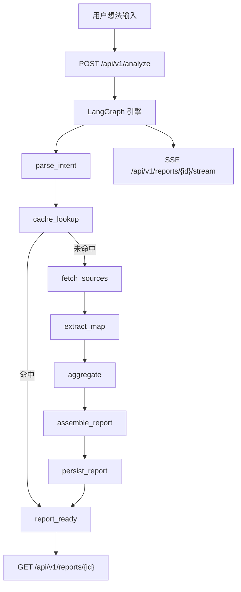

# IdeaGo


面向创业想法的 AI 竞品调研引擎。

[](https://www.python.org/)
[](https://fastapi.tiangolo.com/)
[](https://react.dev/)
[](https://www.langchain.com/langgraph)
[](LICENSE)

简体中文 | [English](README.md)

---

## 目录

- [IdeaGo 能做什么](#ideago-能做什么)
- [核心特性](#核心特性)
- [系统架构](#系统架构)
  - [运行说明](#运行说明)
- [安全模型（移除 APP_API_KEY 之后）](#安全模型移除-app_api_key-之后)
- [技术栈](#技术栈)
  - [后端](#后端)
  - [前端](#前端)
- [快速开始](#快速开始)
  - [1) 前置要求](#1-前置要求)
  - [2) 安装依赖](#2-安装依赖)
  - [3) 配置环境](#3-配置环境)
  - [4) 开发模式（热更新）](#4-开发模式热更新)
  - [5) 单进程本地运行（后端托管构建后的前端）](#5-单进程本地运行后端托管构建后的前端)
  - [6) Docker](#6-docker)
- [API 概览](#api-概览)
  - [SSE 事件类型](#sse-事件类型)
  - [示例](#示例)
- [报告模型](#报告模型)
- [配置说明](#配置说明)
- [项目结构](#项目结构)
- [开发与质量](#开发与质量)
- [容器与 CI 说明（移除 APP_API_KEY 之后）](#容器与-ci-说明移除-app_api_key-之后)
  - [Dockerfile](#dockerfile)
  - [docker-compose](#docker-compose)
  - [CI 镜像构建与推送](#ci-镜像构建与推送)
- [路线图与文档](#路线图与文档)
- [参与贡献](#参与贡献)
- [许可证](#许可证)

---

## IdeaGo 能做什么

IdeaGo 可以把一句自然语言的创业想法，转成结构化竞品分析报告，报告包含：

- 市场总结与结论建议（`go` / `caution` / `no_go`）
- 带来源链接、可追溯的竞品清单
- 差异化机会建议
- 置信度、证据与运行成本透明度

目标是快速验证：一句话输入，得到可审计的调研结论。

---

## 核心特性

- **端到端流水线**：意图解析 -> 多源检索 -> 信息提取 -> 聚合分析 -> 报告生成
- **多数据源检索**：GitHub、Tavily 网页搜索、Hacker News、App Store、Product Hunt
- **LLM 稳定性增强**：请求重试、JSON 解析恢复、端点故障切换
- **链接真实性约束**：提取链接需与原始抓取 URL 严格匹配
- **优雅降级**：提取/聚合失败时仍返回可用结果
- **实时交互体验**：SSE 流式进度、自动重连、任务取消
- **透明报告**：每份报告包含置信度/证据/成本/容错元数据
- **性能导向前端**：路由懒加载、虚拟化列表、竞品对比、导出与打印
- **缓存与运行时状态**：TTL 文件缓存 + LangGraph SQLite 检查点 + 状态文件

---

## 系统架构



### 运行说明

- `POST /analyze` 后端异步执行并立即返回 `report_id`。
- 前端通过 SSE 订阅阶段事件并实时展示进度。
- 对同一标准化查询的并发请求会做去重。
- `analyze` 内置内存限流：每个 IP/会话键 `60s` 内最多 `10` 次请求。

---

## 安全模型（移除 APP_API_KEY 之后）

`APP_API_KEY` / `X-API-Key` 已从后端、前端和运行时注入完全移除。

当前内置控制：

- **请求限流**：对 `POST /api/v1/analyze` 做内存限流（每个 IP/会话键 `60s` 内 `10` 次）。
- **CORS 边界**：通过 `CORS_ALLOW_ORIGINS` 控制允许的浏览器来源（公网部署避免使用 `*`）。
- **输入校验**：FastAPI + Pydantic 对请求负载进行校验。
- **安全错误面**：流程失败仅返回脱敏错误，不暴露内部密钥。

推荐部署控制（尤其对外网开放时）：

- 将 IdeaGo 放在反向代理/API 网关之后（Nginx、Caddy、Cloudflare、Traefik）。
- 增加网络层防护：IP 白名单、VPN、Zero Trust 通道或网关层 Basic Auth。
- 在网关终止 TLS，并保持后端服务处于 Docker 网络/VPC 私有网络内。
- 密钥仅保留在运行时环境变量中（如 `OPENAI_API_KEY`、`TAVILY_API_KEY`），避免写入镜像层。

---

## 技术栈

### 后端

- Python 3.10+
- FastAPI + Uvicorn
- LangGraph 状态机流水线
- LangChain OpenAI 客户端
- Pydantic v2 / pydantic-settings
- 文件缓存 + SQLite 检查点存储

### 前端

- React 19 + TypeScript + Vite 7
- Tailwind CSS 4
- React Router 7
- i18next（中英双语）
- Framer Motion + Recharts

---

## 快速开始

### 1) 前置要求

- Python `3.10+`
- [uv](https://github.com/astral-sh/uv)
- Node.js `20+`

### 2) 安装依赖

```bash
# 后端
uv sync --all-extras

# 前端
npm --prefix frontend install
```

### 3) 配置环境

```bash
cp .env.example .env
```

最小建议配置：

- 必需：`OPENAI_API_KEY`
- 推荐：`TAVILY_API_KEY`

### 4) 开发模式（热更新）

终端 1：

```bash
uv run uvicorn ideago.api.app:create_app --factory --reload --port 8000
```

终端 2：

```bash
npm --prefix frontend run dev
```

访问：

- 前端：[http://localhost:5173](http://localhost:5173)
- 后端健康检查：[http://localhost:8000/api/v1/health](http://localhost:8000/api/v1/health)

### 5) 单进程本地运行（后端托管构建后的前端）

```bash
npm --prefix frontend run build
uv run python -m ideago
```

访问：[http://localhost:8000](http://localhost:8000)

### 6) Docker

```bash
cp .env.example .env
docker compose up --build -d
```

说明：

- **不要**设置 `APP_API_KEY`（已不再支持）。
- `.env` 仅保留真实的提供方密钥（如 `OPENAI_API_KEY`、`TAVILY_API_KEY`）。
- `docker-compose.yml` 默认使用预构建镜像。如需本地构建，请使用：

```bash
docker compose build --no-cache
docker compose up -d
```

访问：[http://localhost:8000](http://localhost:8000)

---

## API 概览

基础前缀：`/api/v1`

| 方法 | 路径 | 说明 |
|---|---|---|
| `POST` | `/analyze` | 启动分析并返回 `report_id` |
| `GET` | `/health` | 服务健康 + 数据源可用性 |
| `GET` | `/reports` | 报告列表（`limit`、`offset`） |
| `GET` | `/reports/{report_id}` | 获取报告（处理中返回 `202`） |
| `GET` | `/reports/{report_id}/status` | 运行状态（`processing/failed/cancelled/complete/not_found`） |
| `GET` | `/reports/{report_id}/stream` | SSE 进度流 |
| `GET` | `/reports/{report_id}/export` | 导出 Markdown |
| `DELETE` | `/reports/{report_id}` | 删除报告 |
| `DELETE` | `/reports/{report_id}/cancel` | 取消进行中的分析 |

### SSE 事件类型

`intent_started`, `intent_parsed`, `source_started`, `source_completed`, `source_failed`, `extraction_started`, `extraction_completed`, `aggregation_started`, `aggregation_completed`, `report_ready`, `cancelled`, `error`

### 示例

```bash
# 启动分析
curl -X POST http://localhost:8000/api/v1/analyze \
  -H "Content-Type: application/json" \
  -d '{"query":"An AI assistant for indie game analytics"}'

# 订阅事件流
curl -N http://localhost:8000/api/v1/reports/<report_id>/stream

# 获取报告
curl http://localhost:8000/api/v1/reports/<report_id>
```

---

## 报告模型

每份报告都包含：

- **核心分析**：竞品列表、市场总结、结论建议、差异化机会
- **置信度信息**：样本量、来源覆盖、来源成功率、综合评分、时效提示
- **证据信息**：关键证据摘要 + 结构化证据项
- **成本遥测**：LLM 调用/重试/故障切换、Token 使用、总耗时
- **容错元数据**：端点回退使用情况与最后错误类型

这样结论可解释、可追溯，而不是黑盒输出。

---

## 配置说明

完整默认值见 `.env.example`，类型定义见 `src/ideago/config/settings.py`。

| 变量 | 必需 | 默认 | 用途 |
|---|---|---|---|
| `OPENAI_API_KEY` | 是 | `""` | LLM 访问密钥 |
| `OPENAI_MODEL` | 否 | `gpt-4o-mini` | 主模型名称 |
| `OPENAI_BASE_URL` | 否 | `""` | OpenAI 兼容端点 |
| `OPENAI_FALLBACK_ENDPOINTS` | 否 | `""` | 备用端点 JSON 数组 |
| `OPENAI_TIMEOUT_SECONDS` | 否 | `60` | LLM 超时时间 |
| `LANGGRAPH_MAX_RETRIES` | 否 | `2` | 重试预算 |
| `LANGGRAPH_JSON_PARSE_MAX_RETRIES` | 否 | `1` | JSON 恢复重试次数 |
| `TAVILY_API_KEY` | 推荐 | `""` | 启用 Tavily 数据源 |
| `GITHUB_TOKEN` | 否 | `""` | 提升 GitHub 速率限制 |
| `PRODUCTHUNT_DEV_TOKEN` | 否 | `""` | 启用 Product Hunt 数据源 |
| `APPSTORE_COUNTRY` | 否 | `us` | App Store 国家码 |
| `PRODUCTHUNT_POSTED_AFTER_DAYS` | 否 | `730` | Product Hunt 抓取时间窗口（天） |
| `MAX_RESULTS_PER_SOURCE` | 否 | `10` | 每源原始结果上限 |
| `SOURCE_TIMEOUT_SECONDS` | 否 | `30` | 数据源超时 |
| `SOURCE_QUERY_CONCURRENCY` | 否 | `2` | 每源并发数 |
| `EXTRACTION_TIMEOUT_SECONDS` | 否 | `60` | LLM 提取超时 |
| `CACHE_DIR` | 否 | `.cache/ideago` | 缓存目录 |
| `CACHE_TTL_HOURS` | 否 | `24` | 缓存有效期 |
| `LANGGRAPH_CHECKPOINT_DB_PATH` | 否 | `.cache/ideago/langgraph-checkpoints.db` | LangGraph 检查点数据库 |
| `CORS_ALLOW_ORIGINS` | 否 | `*` | CORS 允许来源 |
| `HOST` / `PORT` | 否 | `0.0.0.0` / `8000` | 服务监听地址 |
| `VITE_API_BASE_URL` | 否 | `""` | 前端 API 前缀（可选） |

---

## 项目结构

```text
.
|-- src/ideago
|   |-- api/             # FastAPI 应用、路由、Schema、依赖注入
|   |-- pipeline/        # LangGraph 引擎、节点、事件、状态
|   |-- llm/             # 大模型客户端与 Prompt 模板
|   |-- sources/         # 数据源插件（GitHub/Tavily/HN/AppStore/Product Hunt）
|   |-- cache/           # 报告/状态文件缓存
|   |-- models/          # Pydantic 领域模型
|   |-- config/          # 运行时配置
|   `-- observability/   # 日志配置
|-- frontend/            # React + TypeScript 前端
|-- tests/               # Pytest 测试
|-- scripts/             # 发布/开发脚本
|-- doc/                 # 工程规范文档
`-- docs/                # 计划与设计资产
```

---

## 开发与质量

提交前建议运行相关检查：

```bash
uv run ruff check src tests scripts
uv run ruff format --check src tests scripts
uv run mypy src
uv run pytest
npm --prefix frontend run lint
npm --prefix frontend run typecheck
npm --prefix frontend run test
npm --prefix frontend run build
```

---

## 容器与 CI 说明（移除 APP_API_KEY 之后）

### Dockerfile

- 不需要 `APP_API_KEY` 的 build arg 或环境变量。
- Dockerfile 保持无密钥，密钥仅在运行时注入。
- 现有镜像入口与运行流程已兼容移除变更。

### docker-compose

- `.env`、服务 `environment` 或 `env_file` 中不应包含 `APP_API_KEY`。
- 若使用预构建镜像，保持：
  - `image: <registry>/ideago:<tag>`
  - `env_file: .env`
- 若本地构建，请切换为：

```yaml
services:
  ideago:
    build:
      context: .
      dockerfile: Dockerfile
```

### CI 镜像构建与推送

- 现有发布流程可保持不变。
- 如仓库设置中仍有与 `APP_API_KEY` 相关的 CI Secrets/Vars，请移除。
- 保留必要的运行时/提供方密钥（例如 `OPENAI_API_KEY` 仅用于发布说明生成，不用于镜像构建本身）。

---

## 路线图与文档

- 变更记录：[CHANGELOG.md](CHANGELOG.md)
- 贡献指南：[CONTRIBUTING.md](CONTRIBUTING.md)
- 后端规范：[doc/BACKEND_STANDARDS.md](doc/BACKEND_STANDARDS.md)
- 工具规范：[doc/AI_TOOLING_STANDARDS.md](doc/AI_TOOLING_STANDARDS.md)
- 配置指南：[doc/SETTINGS_GUIDE.md](doc/SETTINGS_GUIDE.md)
- SDK 使用指南：[doc/SDK_USAGE.md](doc/SDK_USAGE.md)

---

## 参与贡献

欢迎提交 Issue 和 Pull Request。开始之前请先阅读 [CONTRIBUTING.md](CONTRIBUTING.md)。

---

## 许可证

MIT License。详见 [LICENSE](LICENSE)。
