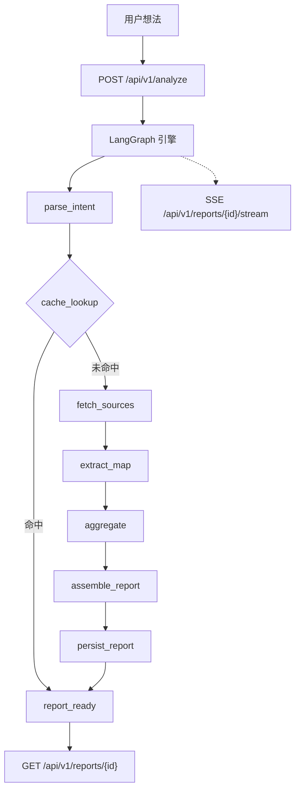

<div align="center">
  
</div>

# IdeaGo：面向创业想法的 AI 竞品调研引擎

**今天的大部分点子死于调研耗时。IdeaGo 让你在几分钟内拿到可审计的、带差异化建议的竞品分析报告。**

[快速开始](#-快速开始) · [系统架构](#-系统架构) · [API 文档](#-api-概览) · [配置说明](#-配置说明) · [English](README.md)

[](https://www.python.org/)
[](https://fastapi.tiangolo.com/)
[](https://react.dev/)
[](https://www.langchain.com/langgraph)
[](LICENSE)

> **[Screenshot Placeholder：IdeaGo 主流程演示 GIF / 视频]**

---

## 📰 最新动态

* **2026-03-25** 正在开发 **SaaS 版本**（`saas` 分支）：多租户、计费与用户工作空间。
* **2026-03-20** 集成 **Supabase 认证**（`feature/supabase-auth`），替代单一 API Key 方案。
* **2026-03-15** **Source Intelligence V2**：报告以决策为先（推荐、痛点、空白机会），再列竞品。

---

## 🤔 为什么需要 IdeaGo？

| **痛点** | **IdeaGo** |
| --- | --- |
| 人工调研慢 | 多源检索（Tavily、GitHub、Reddit、HN）+ 提取与聚合 |
| 大模型会编竞品 | **链接溯源**：竞品需对应已抓取的 URL |
| 报告像套话 | **决策优先**：`go` / `caution` / `no_go`、痛点、空白机会后才是竞品矩阵 |
| 流水线不透明 | **SSE 进度**：意图 → 检索 → 提取 → 聚合，含成本与置信度 |

---

## 🎯 你能得到什么

| 快速验证 | 链接可追溯 | 决策优先 |
| --- | --- | --- |
| 一句话输入，结构化报告输出 | 每条主张有来源，无匿名侧信道 | 先结论与机会，再竞品矩阵 |

---

## ✨ 工作原理

| 流水线 | 数据源 |
| --- | --- |
| LangGraph：意图 → 缓存 → 检索 → 提取 → 聚合 → 报告 | GitHub、Tavily、Hacker News、Reddit、App Store、Product Hunt |

| 稳定性 | 透明度 |
| --- | --- |
| 重试、JSON 恢复、端点故障切换、优雅降级 | 每份报告含置信度、证据与 Token/耗时等遥测 |

---

## 🚀 快速开始

下面 **只选一种** 方式即可。**Docker** 适合本地一键跑通或接近部署形态；**本地开发** 适合改后端/前端并需要热更新。

### 共用前置（所有方式）

* **密钥**：至少要在 `.env` 中配置 `OPENAI_API_KEY`；强烈建议配置 `TAVILY_API_KEY` 以提升网页检索质量。

---

### A) Docker

适合：本机快速体验、或不想在宿主机安装 Python/Node 的“一套起”运行。

**环境要求**

* [Docker](https://docs.docker.com/get-docker/) 与 Docker Compose v2

**步骤**

```bash
cp .env.example .env
# 编辑 .env：填写 OPENAI_API_KEY（以及可选的 TAVILY_API_KEY 等）

docker compose up --build -d
```

**访问**

* 应用：[http://localhost:8000](http://localhost:8000)（端口由 `.env` 中的 `PORT` 决定，默认 `8000`）

**说明**

* `docker-compose.yml` 使用仓库内 [`Dockerfile`](Dockerfile) 构建镜像，并通过 `env_file` 加载 `.env`。
* **不要** 再配置 `APP_API_KEY`（已移除）。密钥只放在运行时环境变量中，不要写入镜像层。

---

### B) 本地开发（热更新）

适合：修改 `src/ideago` 或 `frontend/` 时需要前后端即时反馈。

**环境要求**

* Python **3.10+** 与 [uv](https://github.com/astral-sh/uv)
* Node.js **20+** 与 [pnpm](https://pnpm.io/)

**1）安装依赖**

```bash
uv sync --all-extras
pnpm --prefix frontend install
```

**2）环境变量**

```bash
cp .env.example .env
# 编辑 .env（至少：OPENAI_API_KEY）
```

**3）两个终端分别启动**

终端 1 — 后端 API（热重载）：

```bash
uv run uvicorn ideago.api.app:create_app --factory --reload --port 8000
```

终端 2 — 前端 Vite：

```bash
pnpm --prefix frontend dev
```

**访问**

* 前端：[http://localhost:5173](http://localhost:5173)
* 健康检查：[http://localhost:8000/api/v1/health](http://localhost:8000/api/v1/health)

---

### C) 可选：单进程本地（后端托管构建后的前端）

适合：不需要 Vite 开发服务器、希望一个进程由 FastAPI 提供前端静态资源。

```bash
pnpm --prefix frontend build
uv run python -m ideago
```

**访问**

* [http://localhost:8000](http://localhost:8000)

---

## 🏗️ 系统架构



### 运行说明

* `POST /analyze` 立即返回 `report_id`，分析在后台继续。
* 前端通过 SSE 展示各阶段进度。
* 同一标准化查询的并发进行中请求会去重。
* `POST /api/v1/analyze` 内存限流：每 IP/会话键 **60 秒** 内最多 **10** 次。

---

## 📊 API 概览

基础路径：`/api/v1`

| 方法 | 路径 | 说明 |
| --- | --- | --- |
| `POST` | `/analyze` | 启动分析，返回 `report_id` |
| `GET` | `/health` | 健康检查与数据源可用性 |
| `GET` | `/reports` | 报告列表（`limit`、`offset`） |
| `GET` | `/reports/{report_id}` | 获取报告（处理中返回 `202`） |
| `GET` | `/reports/{report_id}/status` | 运行状态 |
| `GET` | `/reports/{report_id}/stream` | SSE 进度流 |
| `GET` | `/reports/{report_id}/export` | 导出 Markdown |
| `DELETE` | `/reports/{report_id}` | 删除报告 |
| `DELETE` | `/reports/{report_id}/cancel` | 取消任务 |

**示例**

```bash
curl -X POST http://localhost:8000/api/v1/analyze \
  -H "Content-Type: application/json" \
  -d '{"query":"An AI assistant for indie game analytics"}'

curl -N http://localhost:8000/api/v1/reports/<report_id>/stream
```

---

## ⚙️ 配置说明

默认值见 [`.env.example`](.env.example)，类型定义见 [`src/ideago/config/settings.py`](src/ideago/config/settings.py)。

| 变量 | 必需 | 默认 | 用途 |
| --- | --- | --- | --- |
| `OPENAI_API_KEY` | 是 | `""` | LLM 访问 |
| `OPENAI_MODEL` | 否 | `gpt-4o-mini` | 主模型 |
| `OPENAI_FALLBACK_ENDPOINTS` | 否 | `""` | 备用端点 JSON 数组 |
| `TAVILY_API_KEY` | 推荐 | `""` | Tavily 网页检索 |
| `GITHUB_TOKEN` | 否 | `""` | 提高 GitHub 限流 |
| `LANGGRAPH_MAX_RETRIES` | 否 | `2` | 重试预算 |
| `CACHE_DIR` | 否 | `.cache/ideago` | 缓存目录 |
| `SUPABASE_URL` / `SUPABASE_ANON_KEY` | 否 | `""` | Supabase 客户端 |
| `CORS_ALLOW_ORIGINS` | 否 | `*` | 浏览器来源 |

完整列表（超时、并发、Reddit/Product Hunt、LinuxDo OAuth 等）见 `.env.example`。

---

## 🔒 安全说明（移除 `APP_API_KEY` 之后）

`APP_API_KEY` / `X-API-Key` 已从各处移除。

**内置**

* `POST /api/v1/analyze` 限流（见上文）。
* `CORS_ALLOW_ORIGINS` 控制跨域（公网勿滥用 `*`）。
* FastAPI + Pydantic 校验；对客户端返回脱敏错误。

**公网部署建议**

* 前置反向代理或 API 网关（Nginx、Caddy、Cloudflare、Traefik 等）。
* 在边缘终止 TLS，后端放在私有网络。
* 密钥仅运行时注入，勿写入镜像。

---

## 📂 项目结构

```text
.
├── src/ideago/          # FastAPI、LangGraph、数据源、模型
├── frontend/src/        # React 19 应用
├── tests/               # Pytest
├── ai_docs/             # 工程规范
└── docs/                # 设计资源
```

---

## 🛠️ 技术栈

**后端：** Python 3.10+、FastAPI、LangGraph、LangChain OpenAI、Pydantic v2、可选 Supabase。

**前端：** React 19、TypeScript、Vite 7、Tailwind 4、React Router 7、i18next、Supabase JS、Framer Motion、Recharts。

---

## 🤝 开发与质量

```bash
uv run ruff check src tests scripts
uv run ruff format --check src tests scripts
uv run mypy src
uv run pytest

pnpm --prefix frontend lint
pnpm --prefix frontend typecheck
pnpm --prefix frontend test
pnpm --prefix frontend build
```

详见 [CONTRIBUTING.md](CONTRIBUTING.md) 与 [ai_docs/AI_TOOLING_STANDARDS.md](ai_docs/AI_TOOLING_STANDARDS.md)。

---

## 📄 许可证

MIT License。详见 [LICENSE](LICENSE)。
