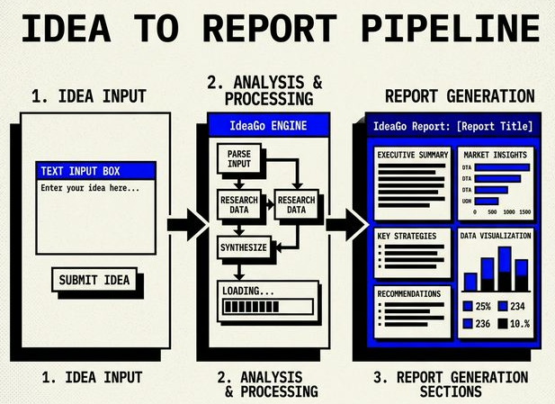
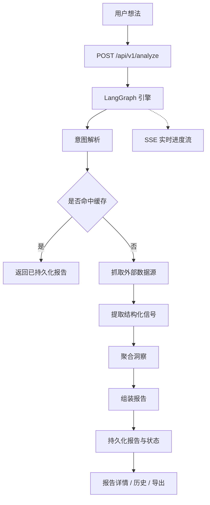

<div align="center">
  

  <h1>IdeaGo</h1>

  <p><strong>面向创业想法的决策优先型 Source Intelligence 工具。</strong></p>

  <p>
    IdeaGo 会把一条模糊的产品想法整理成结构化验证报告，输出推荐结论、痛点信号、
    商业信号、空白机会、竞品、证据与置信度。
  </p>

  <p>
    <a href="README.md">English</a> ·
    <a href="#快速开始">快速开始</a> ·
    <a href="#工作原理">工作原理</a> ·
    <a href="#项目结构">项目结构</a> ·
    <a href="DEPLOYMENT.md">部署说明</a>
  </p>

  <p>
    <a href="LICENSE"></a>
    
    
    
    
    
    <a href="ai_docs/AI_TOOLING_STANDARDS.md"></a>
  </p>
</div>

---

## 项目概览

IdeaGo 当前这份 README 对应的是 `main` 分支，也就是本地部署 / 个人部署版本：
不需要登录，不依赖 Supabase，不包含账单系统，也没有账户体系。

如果你要的是带认证、Profile、Billing、Admin 的商业化版本，请切换到 `saas` 分支。

## 截图

### Hero 截图


### 报告详情截图



## 为什么是 IdeaGo

很多想法验证工具只能给你一份“看起来像总结”的内容，但真正重要的问题其实是：
这个方向现在值不值得做，为什么？

IdeaGo 的报告顺序是明确约定好的：

- recommendation and why-now
- pain signals
- commercial signals
- whitespace opportunities
- competitors
- evidence
- confidence

这不是展示样式，而是产品契约本身。

## `main` 分支能做什么

`main` 分支是匿名、轻部署、适合个人使用的产品线：

- 匿名提交想法并发起分析
- 通过本地文件缓存保留历史报告
- 查看报告详情并导出 Markdown
- 通过 SSE 实时查看长任务进度
- 使用本地 SQLite 保存 LangGraph runtime checkpoint
- 启动时不要求 Supabase、Stripe、LinuxDo 相关变量

当前核心数据源包括：

- Tavily
- Reddit
- GitHub
- Hacker News
- App Store
- Product Hunt

## 快速开始

### 前置要求

- Python 3.10+
- [uv](https://github.com/astral-sh/uv)
- Node.js 20+
- `pnpm`

### 安装依赖

```bash
uv sync --all-extras
pnpm --prefix frontend install
```

### 配置环境变量

```bash
cp .env.example .env
cp frontend/.env.example frontend/.env
```

最小可用配置：

- 必需：`OPENAI_API_KEY`
- 推荐：`TAVILY_API_KEY`

其余默认值已经写在 [`.env.example`](.env.example)。

### 本地开发运行

终端 1：

```bash
uv run uvicorn ideago.api.app:create_app --factory --reload --port 8000
```

终端 2：

```bash
pnpm --prefix frontend dev
```

打开：

- 前端：[http://localhost:5173](http://localhost:5173)
- 后端健康检查：[http://localhost:8000/api/v1/health](http://localhost:8000/api/v1/health)

### 单进程本地运行

```bash
pnpm --prefix frontend build
uv run python -m ideago
```

打开：[http://localhost:8000](http://localhost:8000)

### 使用 Docker Compose 运行（远端镜像）

默认的 `docker-compose.yml` 会使用已发布的 Docker Hub 镜像（`simonsun3/ideago`）。

```bash
cp .env.example .env
docker compose pull
docker compose up -d
```

可选：固定到某个发布版本，而不是 `latest`：

```bash
IDEAGO_IMAGE_TAG=0.3.5 docker compose up -d
```

验证：

```bash
curl http://localhost:8000/api/v1/health
```

## 工作原理

IdeaGo 会接收一条想法，完成意图理解、证据抓取、结构化提取、聚合整理，再生成一份
之后可以从历史记录重新打开的验证报告。



`main` 分支的运行模型：

- API 路由：`/api/v1/analyze`、`/api/v1/reports`、`/api/v1/health`
- 报告持久化：本地 `FileCache`
- 运行 checkpoint：本地 SQLite
- 进度更新方式：SSE
- 用户流程：提交想法 -> 查看进度 -> 阅读报告 -> 从 history 重开 -> 导出 markdown

## API 概览

`main` 分支公开 API：

- `POST /api/v1/analyze`
- `GET /api/v1/reports`
- `GET /api/v1/reports/{id}`
- `GET /api/v1/reports/{id}/status`
- `GET /api/v1/reports/{id}/stream`
- `GET /api/v1/reports/{id}/export`
- `DELETE /api/v1/reports/{id}`
- `DELETE /api/v1/reports/{id}/cancel`
- `GET /api/v1/health`

`main` 不暴露 auth、billing、profile、pricing、admin 相关 API。

## 配置说明

`main` 分支最重要的配置项：

- `OPENAI_API_KEY`
- `OPENAI_MODEL`
- `TAVILY_API_KEY`
- `CACHE_DIR`
- `ANONYMOUS_CACHE_TTL_HOURS`
- `FILE_CACHE_MAX_ENTRIES`
- `LANGGRAPH_CHECKPOINT_DB_PATH`
- `CORS_ALLOW_ORIGINS`

Reddit 相关可选配置：

- `REDDIT_CLIENT_ID`
- `REDDIT_CLIENT_SECRET`

如果没有 Reddit OAuth 凭据，只要 `REDDIT_ENABLE_PUBLIC_FALLBACK=true`，仍然可以退化到公开只读抓取。

## 分支模型

- `main`：个人 / 开源部署版本
- `saas`：在同一核心产品上增加 auth、billing、profile、admin 与 SaaS 专属环境变量

长期同步规则：

- 通用产品能力先进 `main`
- `saas` 再合并 `main`
- 不要把 SaaS 运行时依赖重新带回 `main`

## 项目结构

```text
.
├── src/ideago/          # FastAPI 应用、LangGraph 管线、数据源、模型
├── frontend/src/        # React 前端
├── tests/               # 后端测试
├── ai_docs/             # 项目规范与说明
├── assets/              # main 分支 README 使用的素材
└── DEPLOYMENT.md        # main 分支部署说明
```

关键后端目录：

- `api/`：路由、schema、应用入口、错误处理
- `pipeline/`：编排、事件、merger、extractor、intent parsing
- `cache/`：文件缓存与持久化抽象
- `sources/`：外部数据源抓取器

关键前端目录：

- `frontend/src/app`
- `frontend/src/features/home`
- `frontend/src/features/history`
- `frontend/src/features/reports`
- `frontend/src/lib/api`

## 文档入口

- [部署说明](DEPLOYMENT.md)
- [AI Tooling Standards](ai_docs/AI_TOOLING_STANDARDS.md)
- [Backend Standards](ai_docs/BACKEND_STANDARDS.md)
- [Frontend Standards](ai_docs/FRONTEND_STANDARDS.md)
- [Settings Guide](ai_docs/SETTINGS_GUIDE.md)

## 验证命令

```bash
uv run ruff check src tests scripts
uv run ruff format --check src tests scripts
uv run mypy src
uv run pytest

pnpm --prefix frontend lint
pnpm --prefix frontend typecheck
pnpm --prefix frontend test
pnpm --prefix frontend build
```

## 常见问题

### 这是 SaaS 版本吗？

不是。这份 README 描述的是 `main` 分支，目标是本地部署或个人部署。

### `main` 需要 Supabase 或 Stripe 吗？

不需要。`main` 必须在没有 Supabase、Stripe、LinuxDo 相关变量的情况下正常启动。

### SaaS 文档应该放在哪里？

放在 `saas` 分支里，不要把商业化部署说明混进 `main`。

## 许可证

MIT，见 [LICENSE](LICENSE)。
