# 00 · Codebase 全景地图

> 目标：先建立“当前版本”的目录和职责地图，避免后续沿着旧文档、旧路径、旧心智模型阅读。

## 1) 顶层结构：真正值得看的目录

- `ai_docs/`：项目规范入口，先读这里再动代码
- `src/ideago/`：后端主包
- `frontend/src/`：前端主代码
- `tests/`：后端 pytest 测试，很多设计意图都写在这里
- `docs/`：设计文档、带教文档、项目资料
- `supabase/`：SQL 迁移和 Supabase 相关资源
- `scripts/`：发布和维护脚本

可以先忽略：

- `htmlcov/`
- `logs/`
- `.history/`
- `.cache/`

## 2) 后端模块地图

### A. 应用与路由层

- `src/ideago/__main__.py`
  - `main()`：单进程启动入口
- `src/ideago/api/app.py`
  - `create_app()`：FastAPI 应用工厂
  - 统一装配 CORS、CSRF、防护头、限流、trace id、异常处理、SPA fallback
- `src/ideago/api/routes/analyze.py`
  - `start_analysis()`：校验配额，创建任务，返回 `report_id`
  - `_run_pipeline()`：后台跑完整分析流程
  - `stream_progress()` / `_stream_events()`：SSE 推送与历史重放
  - `cancel_analysis()`：取消运行中分析
- `src/ideago/api/routes/reports.py`
  - 列表、详情、状态、导出、删除
- `src/ideago/api/routes/auth.py`
  - LinuxDo OAuth、profile、quota、token refresh、账号删除
- `src/ideago/api/routes/billing.py`
  - Stripe checkout、portal、webhook
- `src/ideago/api/routes/admin.py`
  - 管理后台统计、用户、健康检查

### B. 依赖装配与运行态层

- `src/ideago/api/dependencies.py`
  - `get_cache()`：按配置选择 `FileCache` 或 Supabase 实现
  - `get_orchestrator()`：装配 LLM、source registry、pipeline 组件
  - `reserve_processing_report()`：按用户维度做并发去重
  - `ReportRunState`：SSE 历史、订阅者、终态内存管理

### C. Pipeline 核心层

- `src/ideago/pipeline/langgraph_engine.py`
  - `LangGraphEngine.run()`：执行图
  - `_build_graph()`：定义节点与分支
- `src/ideago/pipeline/nodes.py`
  - `parse_intent_node`
  - `cache_lookup_node`
  - `fetch_sources_node`
  - `extract_map_node`
  - `aggregate_node`
  - `assemble_report_node`
  - `persist_report_node`
- `src/ideago/pipeline/events.py`
  - `EventType`、`PipelineEvent`
- `src/ideago/pipeline/graph_state.py`
  - 节点间共享状态

### D. 领域能力层

- `src/ideago/pipeline/intent_parser.py`
- `src/ideago/pipeline/extractor.py`
- `src/ideago/pipeline/aggregator.py`
- `src/ideago/pipeline/query_builder.py`
- `src/ideago/pipeline/pre_filter.py`
- `src/ideago/llm/chat_model.py`
  - 模型调用、重试、JSON 恢复、fallback endpoint
- `src/ideago/sources/*.py`
  - GitHub、Tavily、Hacker News、App Store、Product Hunt、Reddit

### E. 持久化与模型层

- `src/ideago/cache/base.py`
  - `ReportRepository` 抽象
- `src/ideago/cache/file_cache.py`
  - 本地开发用缓存与状态文件
- `src/ideago/cache/supabase_cache.py`
  - 生产/多用户场景的持久化实现
- `src/ideago/models/research.py`
  - `ResearchReport`、`Competitor`、`Intent` 等核心模型

## 3) 前端模块地图

### A. 应用壳层

- `frontend/src/app/App.tsx`
  - 路由、主题模式、语言切换、ErrorBoundary、AuthProvider
- `frontend/src/app/main.tsx`
  - React 挂载入口

### B. 业务 feature 层

- `frontend/src/features/home/HomePage.tsx`
  - 登录后首页，发起分析
- `frontend/src/features/reports/ReportPage.tsx`
  - 报告页容器
- `frontend/src/features/reports/components/useReportLifecycle.ts`
  - 报告加载、状态恢复、SSE 协调、重试、取消
- `frontend/src/features/reports/components/ReportContentPane.tsx`
  - 报告主视图
- `frontend/src/features/reports/components/ReportProgressPane.tsx`
  - 进度态展示
- `frontend/src/features/reports/components/VirtualizedCompetitorList.tsx`
  - 大列表虚拟化
- `frontend/src/features/history/HistoryPage.tsx`
  - 报告历史
- `frontend/src/features/profile/ProfilePage.tsx`
  - 资料和订阅管理

### C. 前端基础设施层

- `frontend/src/lib/api/client.ts`
  - 统一 API 客户端
- `frontend/src/lib/api/useSSE.ts`
  - SSE 连接、解析、重连、401 处理
- `frontend/src/lib/auth/*`
  - token、context、受保护路由
- `frontend/src/lib/types/research.ts`
  - 前端报告类型

## 4) 一张图看端到端

```mermaid
flowchart LR
  U["用户提交 Idea"] --> FE1["HomePage / SearchBox"]
  FE1 --> API1["POST /api/v1/analyze"]
  API1 --> A1["start_analysis"]
  A1 --> A2["quota 校验 + 去重"]
  A2 --> BG["_run_pipeline"]
  BG --> G1["LangGraphEngine.run"]
  G1 --> N1["parse_intent"]
  N1 --> N2["cache_lookup"]
  N2 -->|miss| N3["fetch_sources"]
  N3 --> N4["extract_map"]
  N4 --> N5["aggregate"]
  N5 --> N6["assemble_report"]
  N6 --> N7["persist_report"]
  N7 --> C1["FileCache / Supabase"]
  BG --> SSE["GET /reports/{id}/stream"]
  SSE --> FE2["useSSE"]
  FE2 --> FE3["useReportLifecycle"]
  FE3 --> FE4["ReportContentPane / ProgressPane"]
```



## 5) 推荐阅读顺序

1. `ai_docs/AI_TOOLING_STANDARDS.md`
2. `src/ideago/__main__.py`
3. `src/ideago/api/app.py`
4. `src/ideago/api/routes/analyze.py`
5. `src/ideago/api/dependencies.py`
6. `src/ideago/pipeline/langgraph_engine.py`
7. `src/ideago/pipeline/nodes.py`
8. `src/ideago/pipeline/intent_parser.py`
9. `src/ideago/pipeline/extractor.py`
10. `src/ideago/pipeline/aggregator.py`
11. `frontend/src/app/App.tsx`
12. `frontend/src/features/reports/components/useReportLifecycle.ts`
13. `frontend/src/lib/api/useSSE.ts`

## 6) 动手任务

执行下面这些命令，对照地图找入口：

```bash
Select-String -Path src/ideago/api/app.py -Pattern "def create_app"
Select-String -Path src/ideago/api/routes/analyze.py -Pattern "async def start_analysis|async def _run_pipeline|async def _stream_events"
Select-String -Path src/ideago/api/dependencies.py -Pattern "def get_orchestrator|class ReportRunState|async def reserve_processing_report"
Select-String -Path frontend/src/app/App.tsx -Pattern "const ReportPage|<Route path=\"/reports/:id\""
Select-String -Path frontend/src/features/reports/components/useReportLifecycle.ts -Pattern "export function useReportLifecycle"
Select-String -Path frontend/src/lib/api/useSSE.ts -Pattern "export function useSSE"
```

完成标准：

- 你能用自己的话讲清楚“分析链路”和“报告展示链路”分别从哪里开始

---

下一篇：`docs/mentor/01-quickstart-path.md`
